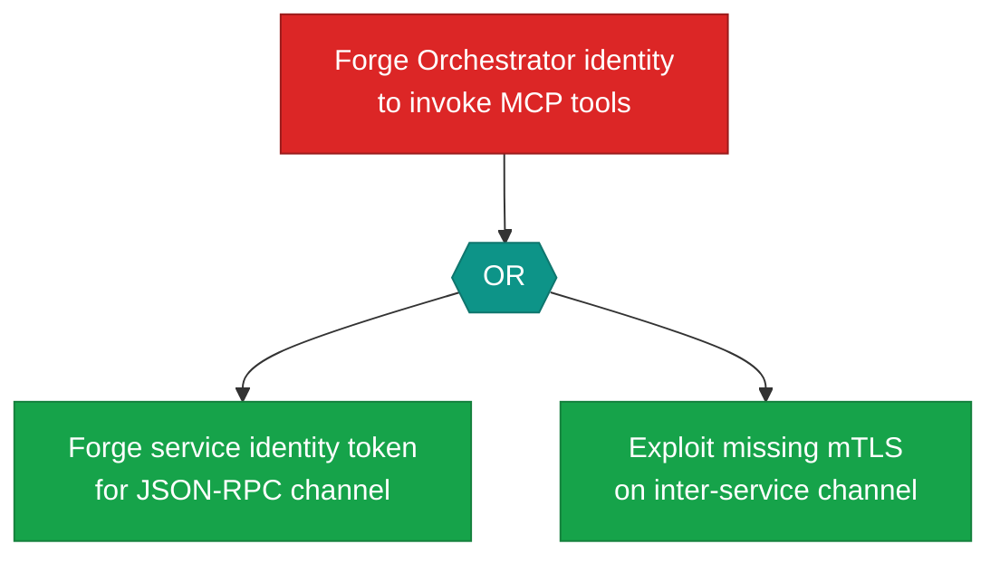

# Attack Tree: S-3 — Service Identity Forgery on JSON-RPC Channel

**Finding**: S-3 | **Component**: LLM Agent Orchestrator | **Risk Level**: High

```mermaid
flowchart TD
    S3_root["Forge Orchestrator identity\nto invoke MCP tools"]
    S3_or1{{"OR"}}
    S3_leaf1["Forge service identity token\nfor JSON-RPC channel"]
    S3_leaf2["Exploit missing mTLS\non inter-service channel"]
    S3_root --> S3_or1
    S3_or1 --> S3_leaf1
    S3_or1 --> S3_leaf2
    classDef goal fill:#DC2626,stroke:#991B1B,color:#FFFFFF
    classDef orGate fill:#0D9488,stroke:#0F766E,color:#FFFFFF
    classDef leaf fill:#16A34A,stroke:#15803D,color:#FFFFFF
    class S3_root goal
    class S3_or1 orGate
    class S3_leaf1,S3_leaf2 leaf
```
