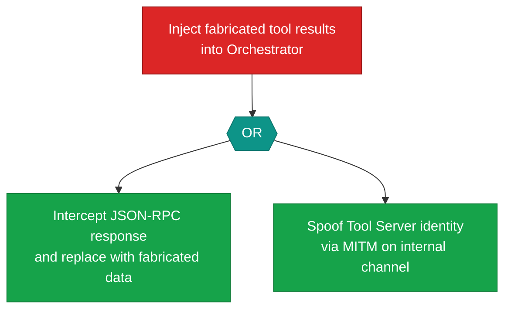

# Attack Tree: S-4 — Tool Server Response Spoofing

**Finding**: S-4 | **Component**: MCP Tool Server | **Risk Level**: High

```mermaid
flowchart TD
    S4_root["Inject fabricated tool results\ninto Orchestrator"]
    S4_or1{{"OR"}}
    S4_leaf1["Intercept JSON-RPC response\nand replace with fabricated data"]
    S4_leaf2["Spoof Tool Server identity\nvia MITM on internal channel"]
    S4_root --> S4_or1
    S4_or1 --> S4_leaf1
    S4_or1 --> S4_leaf2
    classDef goal fill:#DC2626,stroke:#991B1B,color:#FFFFFF
    classDef orGate fill:#0D9488,stroke:#0F766E,color:#FFFFFF
    classDef leaf fill:#16A34A,stroke:#15803D,color:#FFFFFF
    class S4_root goal
    class S4_or1 orGate
    class S4_leaf1,S4_leaf2 leaf
```
