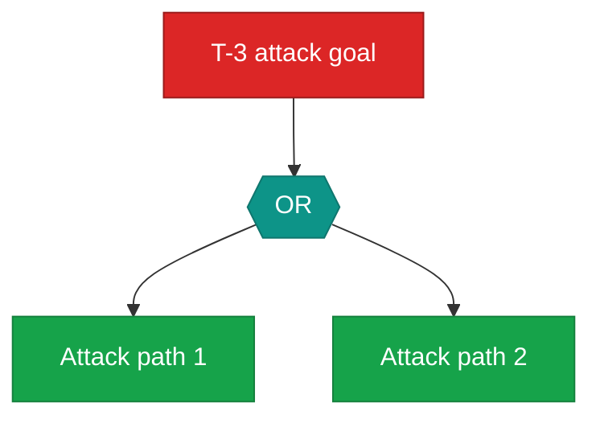

# Attack Tree: T-3

**Finding**: T-3 | **Risk Level**: High

```mermaid
flowchart TD
    _root["T-3 attack goal"]
    _or1{{"OR"}}
    _leaf1["Attack path 1"]
    _leaf2["Attack path 2"]
    _root --> _or1
    _or1 --> _leaf1
    _or1 --> _leaf2
    classDef goal fill:#DC2626,stroke:#991B1B,color:#FFFFFF
    classDef orGate fill:#0D9488,stroke:#0F766E,color:#FFFFFF
    classDef leaf fill:#16A34A,stroke:#15803D,color:#FFFFFF
    class _root goal
    class _or1 orGate
    class _leaf1,_leaf2 leaf
```
