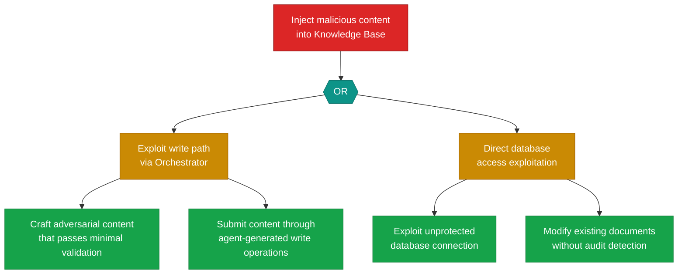

# Attack Tree: T-4 — Knowledge Base Content Injection

**Finding**: T-4 | **Component**: Knowledge Base | **Risk Level**: Critical
**Correlation**: Part of CG-1. See also: LLM-4.

```mermaid
flowchart TD
    T4_root["Inject malicious content\ninto Knowledge Base"]
    T4_or1{{"OR"}}
    T4_sub1["Exploit write path\nvia Orchestrator"]
    T4_sub2["Direct database\naccess exploitation"]
    T4_leaf1["Craft adversarial content\nthat passes minimal validation"]
    T4_leaf2["Submit content through\nagent-generated write operations"]
    T4_leaf3["Exploit unprotected\ndatabase connection"]
    T4_leaf4["Modify existing documents\nwithout audit detection"]
    T4_root --> T4_or1
    T4_or1 --> T4_sub1
    T4_or1 --> T4_sub2
    T4_sub1 --> T4_leaf1
    T4_sub1 --> T4_leaf2
    T4_sub2 --> T4_leaf3
    T4_sub2 --> T4_leaf4
    classDef goal fill:#DC2626,stroke:#991B1B,color:#FFFFFF
    classDef orGate fill:#0D9488,stroke:#0F766E,color:#FFFFFF
    classDef leaf fill:#16A34A,stroke:#15803D,color:#FFFFFF
    classDef sub fill:#CA8A04,stroke:#A16207,color:#FFFFFF
    class T4_root goal
    class T4_or1 orGate
    class T4_sub1,T4_sub2 sub
    class T4_leaf1,T4_leaf2,T4_leaf3,T4_leaf4 leaf
```
