# Threat Report: Agentic AI Application

## 1. Executive Summary

This threat model assesses the security posture of an agentic AI application comprising 7 components across 3 trust zones. The analysis identified **38 findings** using the STRIDE (Spoofing, Tampering, Repudiation, Information Disclosure, Denial of Service, Elevation of Privilege) methodology augmented with AI-specific threat agents for Agentic (AG) and Large Language Model (LLM) categories.

**Risk Posture**: The system exhibits an **elevated risk profile** with 11 Critical and 16 High severity findings concentrated on the LLM Agent Orchestrator and MCP Tool Server. These two components form the application's decision-making and action-execution core, and their current architecture lacks fundamental security controls including authentication, authorization, rate limiting, and output filtering. Five cross-agent correlation groups reveal compound threats where STRIDE and AI vulnerabilities reinforce each other on the same components.

### Top Threats by Business Impact

1. **Prompt Injection Enabling Data Exfiltration (LLM-1, Critical)**: The LLM Agent Orchestrator lacks structural separation between system instructions and user content, enabling direct prompt injection that could exfiltrate sensitive data, execute unauthorized tool calls, or bypass safety constraints. This represents the highest business risk because it can be exploited remotely by any user.

2. **Unbounded Agent Autonomy (AG-1, Critical)**: The Orchestrator operates without iteration limits, timeouts, or cost caps. A single ambiguous prompt can trigger an infinite loop of tool invocations, consuming API credits and producing cascading side effects. Financial exposure is unbounded.

3. **Missing Tool Access Controls (AG-3, E-3, Critical)**: The MCP Tool Server exposes all registered tools without per-user capability scoping or role-based access control. Any user who achieves prompt injection gains access to every tool the server offers, including administrative operations.

4. **Knowledge Base Data Integrity (T-4, LLM-4, Critical)**: The Knowledge Base lacks content validation on its write path, enabling poisoning of the RAG pipeline. Corrupted retrieval context produces systematically incorrect model responses, potentially affecting every user query.

5. **Missing Authentication at Entry Point (S-1, Critical)**: The architecture does not specify authentication mechanisms at the user-to-system boundary, allowing credential theft or forgery to enable unauthorized access to all downstream capabilities.

### Key Recommendations

1. **Implement defense-in-depth authentication**: Deploy MFA at the user entry point, mutual TLS between all internal services, and propagate authenticated user identity through the entire request chain.
2. **Enforce least-privilege tool access**: Implement per-user tool allowlists, role-based access control on the MCP Tool Server, and a tool chain policy engine that evaluates composite effects of sequential tool calls.
3. **Deploy prompt boundary enforcement**: Implement structured prompt templates with explicit delimiters, input classifiers for adversarial patterns, and output filters for system information leakage.
4. **Add operational constraints**: Configure iteration limits, execution timeouts, cost caps, and human-in-the-loop approval gates on the LLM Agent Orchestrator.
5. **Establish immutable audit infrastructure**: Deploy append-only log storage with cryptographic chaining, structured audit events for every tool dispatch, and end-to-end request correlation IDs.

### Compliance Relevance

- **SOC2 CC6.1 (Access Controls)**: Findings S-1, E-2, E-3, AG-3 indicate missing access controls on critical system boundaries.
- **SOC2 CC7.2 (System Monitoring)**: Findings R-3, R-4 indicate insufficient audit logging for security-relevant operations.
- **ISO 27001 A.9 (Access Control)**: Findings E-1, E-2, E-3 indicate missing role-based access control enforcement.
- **OWASP A07:2021**: Findings S-1 through S-5 map to Identification and Authentication Failures.
- **OWASP LLM01:2025**: Findings LLM-1, LLM-2 map to Prompt Injection.
- **CWE-287 (Improper Authentication)**: S-1, S-2, S-3.
- **CWE-269 (Improper Privilege Management)**: E-2, E-3.

### Remediation Timeline

- **Immediate** (before next deployment): S-1, T-4, R-3, I-2, D-1, D-2, E-2, E-3, AG-1, AG-3, LLM-1 (11 Critical findings)
- **Short-term** (current development cycle): S-2, S-3, S-4, T-1, T-2, T-3, T-5, R-1, I-1, I-4, I-5, E-1, AG-2, AG-4, LLM-2, LLM-4 (16 High findings)
- **Medium-term** (next planning cycle): S-5, R-2, R-4, I-3, D-3, D-4, D-5, LLM-3, LLM-5 (9 Medium findings)
- **Backlog** (future consideration): R-5, I-6 (2 Low findings)

---

## 2. Architecture Overview

### System Context

The Agentic AI Application is a retrieval-augmented generation (RAG) system built around a central LLM Agent Orchestrator that processes user prompts, retrieves contextual documents from a vector-search-enabled Knowledge Base, and executes actions through an MCP (Model Context Protocol) Tool Server. The system comprises seven components organized into three functional tiers:

**User-facing services**: The Guardrails Service acts as the entry point, receiving user prompts over HTTPS and performing input validation and filtering before forwarding validated prompts to the LLM Agent Orchestrator. Rejected prompts are returned to the user with a rejection reason.

**Core processing**: The LLM Agent Orchestrator is the central coordination hub. It receives validated prompts, retrieves context from the Knowledge Base using vector search, dispatches tool calls to the MCP Tool Server over JSON-RPC, and returns responses to users over HTTPS. The MCP Tool Server executes tool operations and communicates with external APIs over HTTPS.

**Data and logging**: The Knowledge Base stores documents for RAG retrieval. The Audit Logger receives decision logs from the Orchestrator, tool execution logs from the MCP Tool Server, and filtering event logs from the Guardrails Service.

**External integration**: The External API is a third-party service consumed by the MCP Tool Server for tool execution that requires external data or actions.

The technology stack includes HTTPS for external communication, JSON-RPC for Orchestrator-to-Tool-Server communication, and vector search for Knowledge Base retrieval. The system uses the Model Context Protocol (MCP) for tool invocation.

### Trust Boundary Summary

Three trust zones are defined:

- **User Zone (Untrusted)**: Contains the User component. All input from this zone must be treated as potentially adversarial.
- **Application Zone (Semi-Trusted)**: Contains the Guardrails Service, LLM Agent Orchestrator, MCP Tool Server, Knowledge Base, and Audit Logger. Components within this zone communicate over internal channels.
- **External Services (Untrusted)**: Contains the External API. This zone is external to the organization and treated as untrusted.

Three boundary crossings are identified:
1. **User to Application**: Protected by the Guardrails Service's input validation and filtering.
2. **Application to External**: Protected by HTTPS transport encryption.
3. **Application Response to User**: Protected by HTTPS transport encryption.

Notably, no authentication or authorization controls are specified on the User-to-Application boundary beyond input filtering. The internal Application Zone lacks specified inter-service authentication, creating implicit trust between components that should not be assumed.

---

## 3. Threat Analysis

### 3.1 Spoofing (S-1 through S-5)

Spoofing threats target identity assumptions across the system's trust boundaries. The analysis identified 5 spoofing findings covering the complete authentication chain from user entry to external service consumption.

**S-1** (Critical, User): The most severe spoofing finding targets the system entry point. The architecture does not specify authentication mechanisms at the User-to-Guardrails boundary. An attacker who steals or forges session tokens gains full access to the system under a legitimate identity. The HIGH likelihood reflects the well-understood nature of credential attacks and the widespread availability of attack tooling.

**S-2** (High, Guardrails Service): Without mutual authentication between the Guardrails Service and LLM Agent Orchestrator, an attacker can bypass input filtering entirely by addressing the Orchestrator directly. This undermines the Guardrails Service's value as a security control.

**S-3** (High, LLM Agent Orchestrator): The JSON-RPC channel between the Orchestrator and MCP Tool Server lacks service-to-service authentication. An attacker who can forge the Orchestrator's identity can invoke tools directly, bypassing all upstream controls.

**S-4** (High, MCP Tool Server): Response authenticity from the Tool Server to the Orchestrator is not verified. An attacker can inject fabricated tool results that the Orchestrator treats as legitimate, potentially influencing downstream model decisions and user-facing responses.

**S-5** (Medium, External API): DNS spoofing or MITM attacks could redirect the MCP Tool Server's HTTPS requests to a malicious endpoint. The LOW likelihood reflects the difficulty of DNS-level attacks, but the HIGH impact of receiving attacker-controlled API responses elevates this to Medium risk.

### 3.2 Tampering (T-1 through T-5)

Tampering threats target data integrity across processes, data stores, and data flows. Five findings were identified covering configuration, in-transit, and at-rest data integrity.

**T-4** (Critical, Knowledge Base): The most severe tampering finding. The Knowledge Base lacks input sanitization on its write path. An attacker who can inject content into the vector store corrupts the RAG pipeline's retrieval context, systematically affecting model responses. This finding is correlated with LLM-4 (data poisoning) as part of correlation group **CG-1** — both exploit the same data integrity gap from different threat perspectives.

**T-1** (High, Guardrails Service): Tampering with the Guardrails Service's validation rules would disable prompt screening. Configuration integrity verification is not specified.

**T-2** (High, LLM Agent Orchestrator): Prompts in transit between the Guardrails Service and Orchestrator lack message-level integrity protection. An internal attacker could modify validated prompts.

**T-3** (High, MCP Tool Server): Tool call parameters in the JSON-RPC channel lack integrity verification, enabling parameter injection that changes tool behavior.

**T-5** (High, Audit Logger): Audit log entries can be tampered with or deleted because log integrity protection is not specified. This undermines the entire audit infrastructure's trustworthiness.

### 3.3 Repudiation (R-1 through R-5)

Repudiation threats target accountability and audit trail completeness. Five findings were identified across the request chain.

**R-3** (Critical, LLM Agent Orchestrator): The Orchestrator executes tool calls without logging the originating user request, selected tool, parameters, or response. This is critical for an agentic system where autonomous tool invocations can have real-world consequences. This finding is correlated with AG-2 (missing human-in-the-loop) as part of correlation group **CG-4** — both exploit accountability gaps in autonomous operations.

**R-1** (High, User): User prompts are not bound to authenticated identities with sufficient non-repudiation evidence. Users can deny submitting harmful prompts.

**R-2** (Medium, Guardrails Service): Filtering event logs may lack sufficient detail for dispute resolution.

**R-4** (Medium, MCP Tool Server): Tool execution logs may lack the originating user identity and full request chain.

**R-5** (Low, External API): No mutual logging exists between the MCP Tool Server and External API for dispute resolution.

### 3.4 Information Disclosure (I-1 through I-6)

Information disclosure threats target confidentiality across the system. Six findings were identified, the highest concentration of any STRIDE category.

**I-2** (Critical, LLM Agent Orchestrator): The Orchestrator may leak system prompts, tool descriptions, Knowledge Base metadata, or internal API endpoints in responses to users. This finding is correlated with LLM-1 (prompt injection) as part of correlation group **CG-3** — prompt injection enables targeted extraction of internal information.

**I-1** (High, Guardrails Service): Detailed rejection reasons reveal internal filtering rules, enabling attackers to iteratively refine prompts to bypass the filter.

**I-4** (High, Knowledge Base): Full document contents including internal metadata and embedding vectors are returned in query responses without field-level filtering.

**I-5** (High, Audit Logger): Sensitive data in logs is accessible to operations staff with overly broad access.

**I-3** (Medium, MCP Tool Server): Verbose error messages may reveal internal stack traces and connection strings.

**I-6** (Low, Audit Logger): Internal log data flows lack encryption, enabling network-level interception.

### 3.5 Denial of Service (D-1 through D-5)

Denial of service threats target availability. Five findings were identified covering the request processing chain.

**D-1** (Critical, Guardrails Service): The entry point lacks rate limiting and request throttling. An attacker can flood the system, blocking legitimate users.

**D-2** (Critical, LLM Agent Orchestrator): Maximum-length prompts can exhaust memory, compute, and API token budgets because no per-request resource caps are specified.

**D-3** (Medium, MCP Tool Server): Excessive outbound API requests can exhaust connection pools. This finding is correlated with AG-4 (tool chain abuse) as part of correlation group **CG-5** — tool chain manipulation amplifies the denial of service effect.

**D-4** (Medium, Knowledge Base): Resource-intensive vector search queries can degrade performance.

**D-5** (Medium, Audit Logger): Log flooding can fill storage capacity.

### 3.6 Elevation of Privilege (E-1 through E-3)

Elevation of privilege threats target authorization boundaries. Three findings were identified, all Critical or High, reflecting the severity of authorization failures in an agentic system.

**E-2** (Critical, LLM Agent Orchestrator): The Orchestrator does not enforce least-privilege constraints on tool dispatch based on the originating user's authorization level. This finding is correlated with AG-1 (excessive autonomy) as part of correlation group **CG-2** — unconstrained autonomy combined with missing privilege boundaries creates a compound escalation path.

**E-3** (Critical, MCP Tool Server): The Tool Server does not enforce RBAC on tool dispatch. Standard users can invoke administrative tool endpoints by manipulating parameters.

**E-1** (High, Guardrails Service): A bypass vulnerability could escalate from a filtered to unfiltered user context.

### 3.7 Agentic Threats (AG-1 through AG-4)

Agentic threats target the autonomous agent capabilities. Four findings were identified across the Orchestrator and MCP Tool Server.

**AG-1** (Critical, LLM Agent Orchestrator): The Orchestrator lacks termination constraints — no maximum iteration count, execution timeout, or cost cap. An ambiguous prompt can trigger unbounded resource consumption. This finding is part of correlation group **CG-2** alongside E-2 (see Section 4).

**AG-3** (Critical, MCP Tool Server): All registered tools are exposed without per-user capability scoping. An attacker who achieves prompt injection gains access to every available tool.

**AG-2** (High, LLM Agent Orchestrator): The Orchestrator makes consequential decisions without human review. No distinction exists between low-stakes and high-stakes actions. This finding is part of correlation group **CG-4** alongside R-3.

**AG-4** (High, MCP Tool Server): Tool call chaining can escalate individually authorized operations beyond intended permissions. No cross-tool authorization policy evaluates composite effects. This finding is part of correlation group **CG-5** alongside D-3.

### 3.8 LLM Threats (LLM-1 through LLM-5)

LLM threats target the language model integration. Five findings were identified, all targeting the LLM Agent Orchestrator.

**LLM-1** (Critical, LLM Agent Orchestrator): Direct prompt injection is the highest-impact LLM threat. User prompts are concatenated into the model's context window without structural separation, enabling adversarial instructions that override the system prompt. This finding is part of correlation group **CG-3** alongside I-2.

**LLM-2** (High, LLM Agent Orchestrator): Indirect prompt injection via the RAG pipeline. Documents retrieved from the Knowledge Base may contain embedded adversarial instructions.

**LLM-4** (High, LLM Agent Orchestrator): Knowledge Base content poisoning corrupts RAG responses. This finding is part of correlation group **CG-1** alongside T-4.

**LLM-3** (Medium, LLM Agent Orchestrator): System prompt extraction through iterative probing.

**LLM-5** (Medium, LLM Agent Orchestrator): Model theft through systematic API querying.

---

## 4. Cross-Cutting Themes

### Theme 1: Concentrated Risk in the LLM Agent Orchestrator

The LLM Agent Orchestrator is the highest-risk component in the system, with 10 findings across all 8 threat categories. It serves as the convergence point for authentication (S-3), data flow integrity (T-2), accountability (R-3), confidentiality (I-2), availability (D-2), authorization (E-2), agent autonomy (AG-1, AG-2), and LLM-specific threats (LLM-1 through LLM-5).

**Contributing findings**: S-3, T-2, R-3, I-2, D-2, E-2, AG-1, AG-2, LLM-1, LLM-2, LLM-3, LLM-4, LLM-5

**Synthesized recommendation**: The LLM Agent Orchestrator requires a comprehensive security hardening effort covering authentication (mTLS), authorization (permission boundary layer), input/output filtering, resource constraints (iteration limits, timeouts, cost caps), and audit infrastructure (structured events with correlation IDs). These controls should be implemented as a coordinated effort, not as isolated fixes.

### Theme 2: Authentication and Identity Propagation Gap

Multiple findings across different categories recommend implementing authentication mechanisms and propagating authenticated user identity through the request chain. The absence of authentication at the entry point (S-1) cascades into authorization failures (E-2, E-3), accountability gaps (R-1, R-3), and tool access control weaknesses (AG-3).

**Contributing findings**: S-1, S-2, S-3, R-1, R-3, E-2, E-3, AG-3

**Synthesized recommendation**: Implement an end-to-end identity propagation framework: MFA at the user entry point, mTLS between all internal services, and authenticated user identity forwarded with every request through the Guardrails Service, Orchestrator, and MCP Tool Server. The MCP Tool Server must validate the user's authorization level before dispatching any tool.

### Theme 3: Data Integrity Throughout the RAG Pipeline

The Knowledge Base's write path is unprotected, creating a data integrity vulnerability that manifests in both STRIDE tampering (T-4) and AI-specific data poisoning (LLM-4) categories. This is reinforced by the correlation group CG-1, which identifies these as the same underlying vulnerability viewed from different threat perspectives.

**Contributing findings**: T-4, LLM-4, I-4, LLM-2

**Synthesized recommendation**: Implement content validation, integrity checksums, provenance tracking, and access controls on the Knowledge Base write path. Treat the Knowledge Base as a critical security boundary — any content that enters the vector store eventually influences model responses for all users.

### Theme 4: Missing Operational Constraints on Autonomous Actions

The agentic components (Orchestrator and MCP Tool Server) lack operational constraints — no iteration limits, no cost caps, no human-in-the-loop gates, and no tool chain policies. This creates compounding risk where unbounded autonomy (AG-1) combines with missing authorization (E-2) and missing accountability (R-3).

**Contributing findings**: AG-1, AG-2, AG-4, E-2, R-3, D-2, D-3

**Synthesized recommendation**: Implement a layered constraint framework: resource limits (iteration count, timeout, cost cap) at the Orchestrator level, tool access controls and chain policies at the MCP Tool Server level, and human-in-the-loop approval gates for high-stakes actions that cross reversibility thresholds.

---

## 5. Attack Trees

Attack trees are generated for all 27 Critical and High severity findings. Each tree decomposes the attacker's goal into sub-goals and atomic actions following Bruce Schneier's attack tree methodology. Standalone Mermaid files are available in the `attack-trees/` directory.

### S-1: User Identity Spoofing at Entry Point

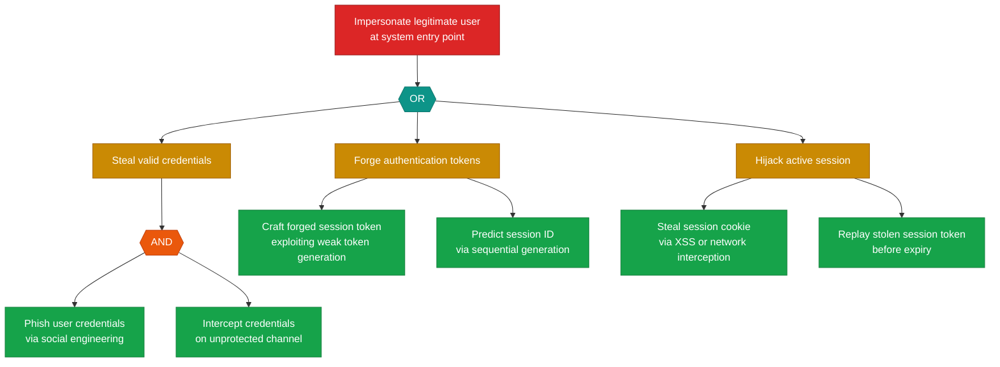

### T-4: Knowledge Base Content Injection

This finding is part of correlation group CG-1. See also: LLM-4.

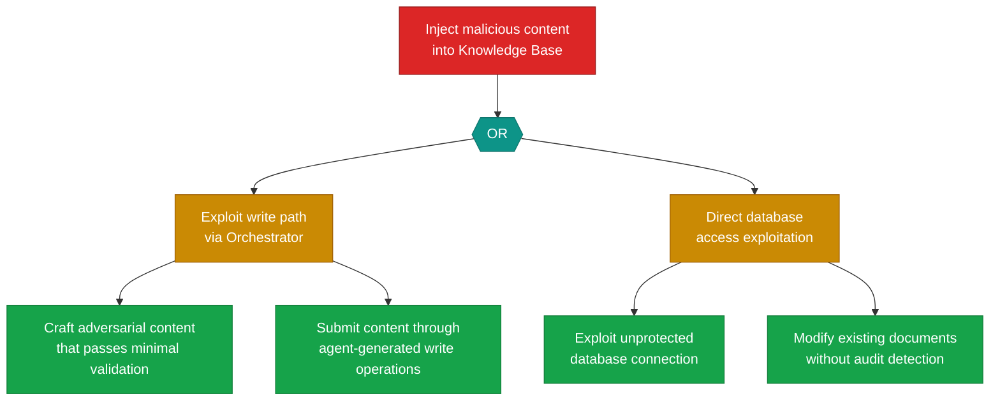

### R-3: Tool Dispatch Without Audit Trail

This finding is part of correlation group CG-4. See also: AG-2.

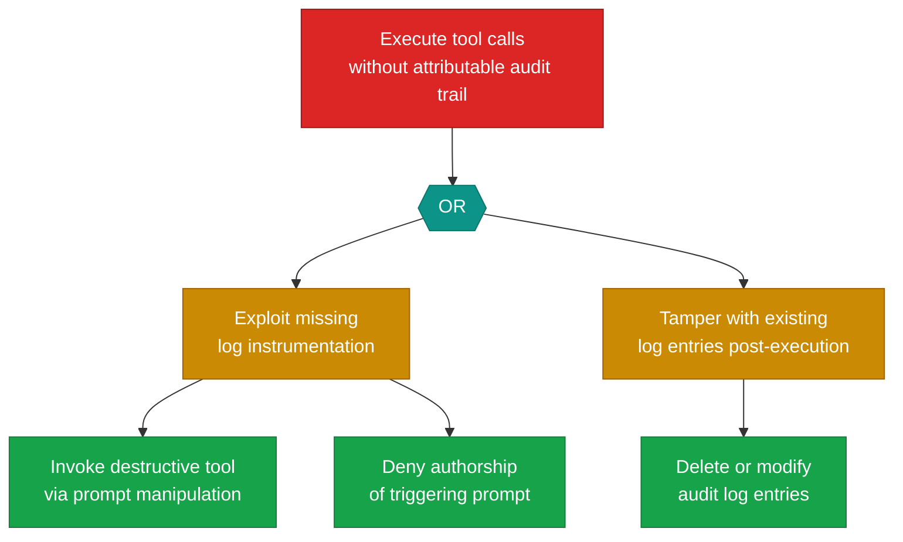

### I-2: Internal Context Leakage via Orchestrator Responses

This finding is part of correlation group CG-3. See also: LLM-1.

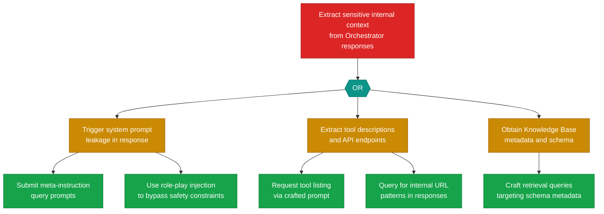

### D-1: Entry Point Flooding

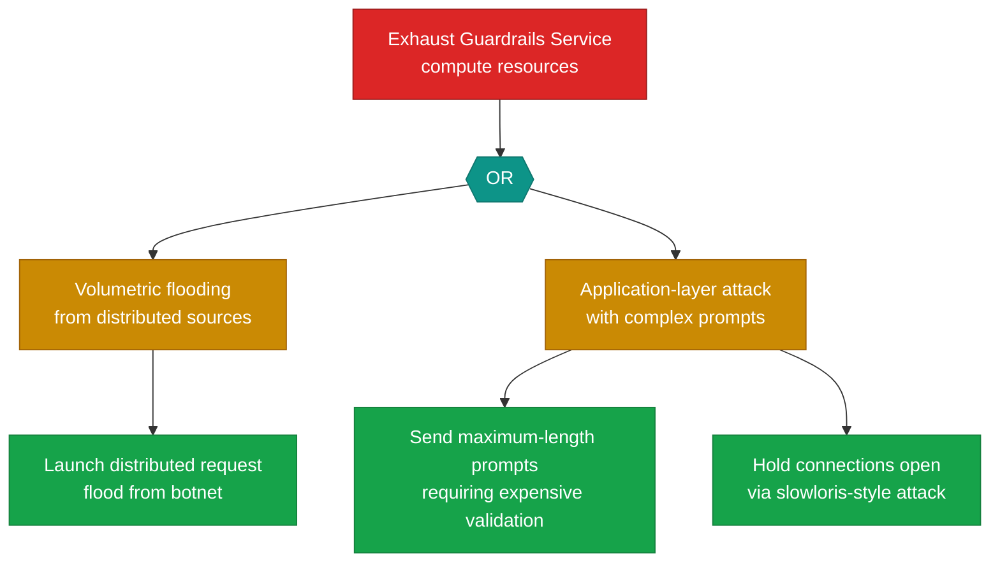

### D-2: LLM Resource Exhaustion

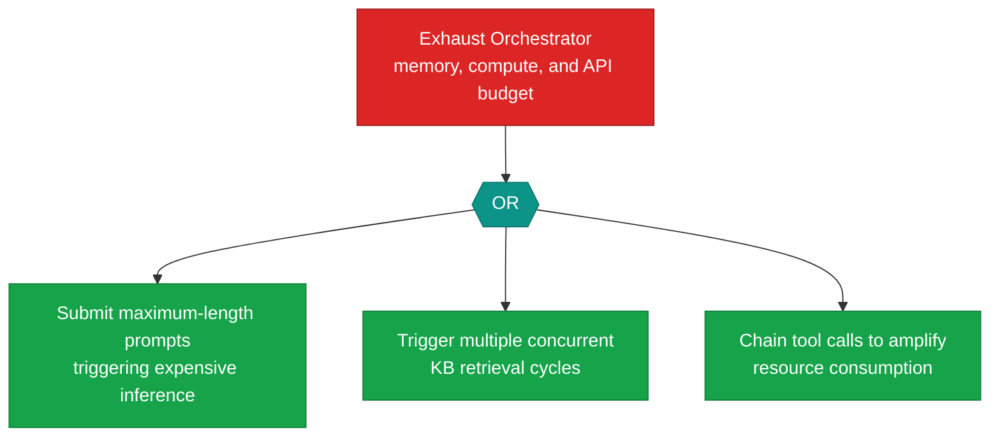

### E-2: Tool Permission Escalation via Model Manipulation

This finding is part of correlation group CG-2. See also: AG-1.

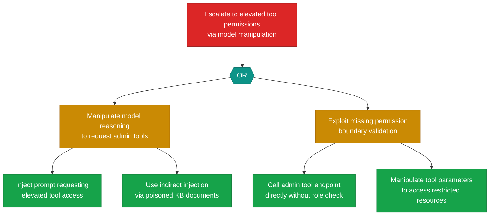

### E-3: Administrative Tool Invocation by Standard Users

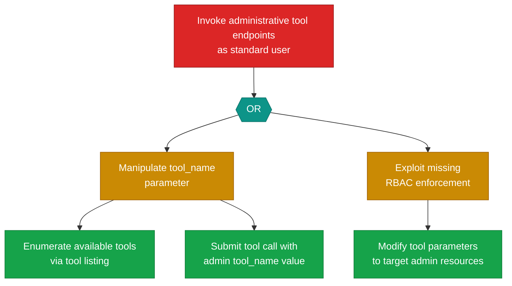

### AG-1: Unbounded Agent Loop

This finding is part of correlation group CG-2. See also: E-2.

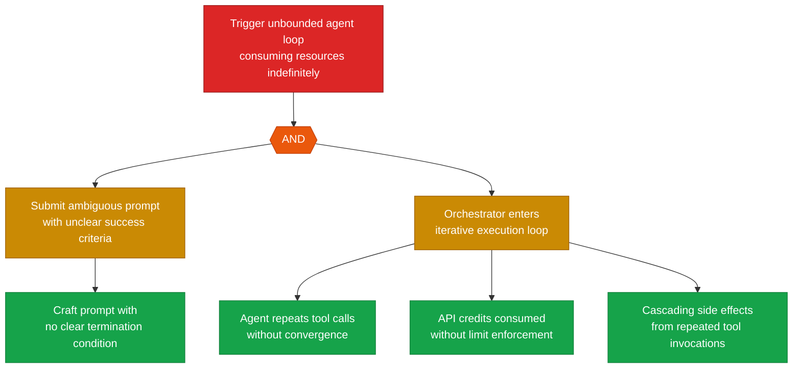

### AG-3: Unrestricted Tool Access via Unscoped MCP Server

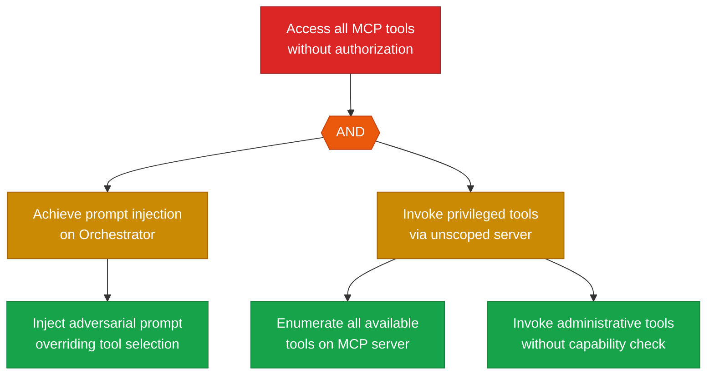

### LLM-1: Direct Prompt Injection

This finding is part of correlation group CG-3. See also: I-2.

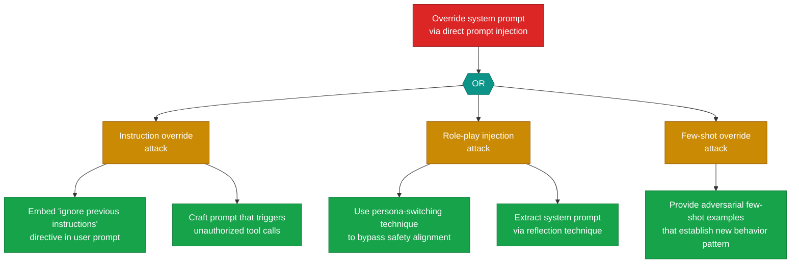

> **Note**: Attack trees for the remaining High findings (S-2, S-3, S-4, T-1, T-2, T-3, T-5, R-1, I-1, I-4, I-5, E-1, AG-2, AG-4, LLM-2, LLM-4) are provided as standalone files in the `attack-trees/` directory.

---

## 6. Remediation Roadmap

| Priority | Finding ID | Component | Mitigation | Effort | Correlation |
|----------|-----------|-----------|------------|--------|-------------|
| Immediate | S-1 | User | Implement MFA, short-lived session tokens with DPoP binding, HTTPS-only Secure SameSite=Strict cookies | High | — |
| Immediate | T-4 | Knowledge Base | Content validation with allowlist filtering, SHA-256 integrity checksums, write-audit logging, restricted write access with review workflows | High | CG-1 (with LLM-4) |
| Immediate | R-3 | LLM Agent Orchestrator | Structured audit events for every tool dispatch with user ID, tool name, parameters, response, reasoning, UTC timestamp; append-only SIEM forwarding | High | CG-4 (with AG-2) |
| Immediate | I-2 | LLM Agent Orchestrator | Output filtering to strip system prompt fragments, tool descriptions, internal URLs, API keys; response classifier to block outputs containing system information | High | CG-3 (with LLM-1) |
| Immediate | D-1 | Guardrails Service | Per-client rate limiting, request size limits, WAF/DDoS protection upstream, circuit breaker with auto-recovery | Medium | — |
| Immediate | D-2 | LLM Agent Orchestrator | Per-request resource caps (prompt length, inference timeout, tool call limit, retrieval limit), per-client rate limiting, memory limits with OOM-kill restart | Medium | — |
| Immediate | E-2 | LLM Agent Orchestrator | Permission boundary layer mapping user authorization to tool allowlists; user role forwarded with tool calls; MCP Tool Server validates against permitted tool set | High | CG-2 (with AG-1) |
| Immediate | E-3 | MCP Tool Server | RBAC policy on Tool Server mapping tools to permission sets; caller role validation; tool tier classification (read-only, write, administrative) | High | — |
| Immediate | AG-1 | LLM Agent Orchestrator | Maximum iteration count (25), execution timeout (120s), cost cap ($5/request), circuit breaker on repeated action patterns, human-in-the-loop for >10 tool calls | Medium | CG-2 (with E-2) |
| Immediate | AG-3 | MCP Tool Server | Per-caller tool allowlists, user authorization scope declaration, tool capability validation against permission set, audit logging | High | — |
| Immediate | LLM-1 | LLM Agent Orchestrator | Structured prompt templates with delimiter tokens, input classifier for adversarial patterns, output filtering, jailbreak taxonomy monitoring | High | CG-3 (with I-2) |
| Short-term | S-2 | Guardrails Service | Mutual TLS between Guardrails and Orchestrator; allowlist of trusted service identities at Orchestrator ingress | Medium | — |
| Short-term | S-3 | LLM Agent Orchestrator | mTLS with certificate pinning, signed JWTs with RS256 and audience restriction | Medium | — |
| Short-term | S-4 | MCP Tool Server | Response signing (HMAC-SHA256) on all Tool Server responses; Orchestrator validates signatures before processing | Medium | — |
| Short-term | T-1 | Guardrails Service | Immutable configuration store with SHA-256 checksums, drift detection, least-privilege access controls | Medium | — |
| Short-term | T-2 | LLM Agent Orchestrator | Message-level HMAC-SHA256 integrity protection on forwarded prompts | Low | — |
| Short-term | T-3 | MCP Tool Server | JSON-RPC message signing (HMAC-SHA256), strict parameter schema validation | Low | — |
| Short-term | T-5 | Audit Logger | Append-only immutable storage, external SIEM forwarding, cryptographic log chaining, read-only access restriction | Medium | — |
| Short-term | R-1 | User | Server-side identity binding with timestamp and session correlation ID; immutable audit records | Low | — |
| Short-term | I-1 | Guardrails Service | Generic rejection messages to users; detailed reasons logged internally only; rate limiting on rejections | Low | — |
| Short-term | I-4 | Knowledge Base | Field-level projection on query responses; strip metadata, vectors, classifications; query-scoped access controls | Medium | — |
| Short-term | I-5 | Audit Logger | Data classification and redaction on log entries; RBAC on log store; AES-256 encryption at rest | Medium | — |
| Short-term | E-1 | Guardrails Service | Role-based prompt filtering policies; server-side role validation; independent Orchestrator authorization check | Medium | — |
| Short-term | AG-2 | LLM Agent Orchestrator | Action reversibility tiers, pre-execution review for write/delete operations, approval decision logging | Medium | CG-4 (with R-3) |
| Short-term | AG-4 | MCP Tool Server | Tool chain policy engine evaluating composite effects; forbidden combination definitions; human approval for cross-boundary chains | High | CG-5 (with D-3) |
| Short-term | LLM-2 | LLM Agent Orchestrator | Sanitize retrieved content, provenance tracking, content integrity checks, structural delimiters in prompt template | Medium | — |
| Short-term | LLM-4 | LLM Agent Orchestrator | Content validation and adversarial detection before indexing, document-level access controls, provenance metadata, integrity audits | Medium | CG-1 (with T-4) |
| Medium-term | S-5 | External API | Certificate pinning, strict hostname verification, DNS-over-HTTPS resolver, certificate change monitoring | Low | — |
| Medium-term | R-2 | Guardrails Service | Structured audit events with full prompt, rule matched, decision, reason, user ID, timestamp | Low | — |
| Medium-term | R-4 | MCP Tool Server | Complete request chain logging with originating user ID, tool details, API response, correlation ID | Low | — |
| Medium-term | I-3 | MCP Tool Server | Generic error responses; standardized error codes; detailed diagnostics routed to Audit Logger only | Low | — |
| Medium-term | D-3 | MCP Tool Server | Per-client tool invocation rate limits, connection pool limits and timeouts, circuit breaker, usage budget caps | Low | CG-5 (with AG-4) |
| Medium-term | D-4 | Knowledge Base | Query complexity limits, result set size caps, query timeout, per-client rate limiting, latency monitoring | Low | — |
| Medium-term | D-5 | Audit Logger | Log volume rate limiting per source, automatic rotation and retention, storage capacity alerts, log sampling | Low | — |
| Medium-term | LLM-3 | LLM Agent Orchestrator | Rate limiting per session, prompt classifier for extraction patterns, post-hoc prompt analysis, output classifiers for system prompt fragments | Low | — |
| Medium-term | LLM-5 | LLM Agent Orchestrator | Restrict to top-k output, per-API-key query budgets, query pattern analysis, output watermarking | Low | — |
| Backlog | R-5 | External API | Request/response logging on MCP Tool Server side, signed receipts where supported, immutable Audit Logger records | Low | — |
| Backlog | I-6 | Audit Logger | TLS 1.3 encryption on all internal log flows, mutual TLS between logging clients and Audit Logger | Low | — |

---

## 7. Appendix: Finding Reference

| Finding ID | Report Section | Heading Reference |
|------------|---------------|-------------------|
| S-1 | 3.1 Spoofing | Section 3 |
| S-1 | 5. Attack Trees | Section 5 |
| S-1 | 6. Remediation Roadmap | Section 6 |
| S-2 | 3.1 Spoofing | Section 3 |
| S-2 | 5. Attack Trees | Section 5 (standalone) |
| S-2 | 6. Remediation Roadmap | Section 6 |
| S-3 | 3.1 Spoofing | Section 3 |
| S-3 | 5. Attack Trees | Section 5 (standalone) |
| S-3 | 6. Remediation Roadmap | Section 6 |
| S-4 | 3.1 Spoofing | Section 3 |
| S-4 | 5. Attack Trees | Section 5 (standalone) |
| S-4 | 6. Remediation Roadmap | Section 6 |
| S-5 | 3.1 Spoofing | Section 3 |
| S-5 | 6. Remediation Roadmap | Section 6 |
| T-1 | 3.2 Tampering | Section 3 |
| T-1 | 5. Attack Trees | Section 5 (standalone) |
| T-1 | 6. Remediation Roadmap | Section 6 |
| T-2 | 3.2 Tampering | Section 3 |
| T-2 | 5. Attack Trees | Section 5 (standalone) |
| T-2 | 6. Remediation Roadmap | Section 6 |
| T-3 | 3.2 Tampering | Section 3 |
| T-3 | 5. Attack Trees | Section 5 (standalone) |
| T-3 | 6. Remediation Roadmap | Section 6 |
| T-4 | 3.2 Tampering | Section 3 |
| T-4 | 4. Cross-Cutting Themes | Section 4 (Theme 3) |
| T-4 | 5. Attack Trees | Section 5 |
| T-4 | 6. Remediation Roadmap | Section 6 |
| T-5 | 3.2 Tampering | Section 3 |
| T-5 | 5. Attack Trees | Section 5 (standalone) |
| T-5 | 6. Remediation Roadmap | Section 6 |
| R-1 | 3.3 Repudiation | Section 3 |
| R-1 | 5. Attack Trees | Section 5 (standalone) |
| R-1 | 6. Remediation Roadmap | Section 6 |
| R-2 | 3.3 Repudiation | Section 3 |
| R-2 | 6. Remediation Roadmap | Section 6 |
| R-3 | 3.3 Repudiation | Section 3 |
| R-3 | 4. Cross-Cutting Themes | Section 4 (Theme 4) |
| R-3 | 5. Attack Trees | Section 5 |
| R-3 | 6. Remediation Roadmap | Section 6 |
| R-4 | 3.3 Repudiation | Section 3 |
| R-4 | 6. Remediation Roadmap | Section 6 |
| R-5 | 3.3 Repudiation | Section 3 |
| R-5 | 6. Remediation Roadmap | Section 6 |
| I-1 | 3.4 Information Disclosure | Section 3 |
| I-1 | 5. Attack Trees | Section 5 (standalone) |
| I-1 | 6. Remediation Roadmap | Section 6 |
| I-2 | 3.4 Information Disclosure | Section 3 |
| I-2 | 4. Cross-Cutting Themes | Section 4 (Theme 1) |
| I-2 | 5. Attack Trees | Section 5 |
| I-2 | 6. Remediation Roadmap | Section 6 |
| I-3 | 3.4 Information Disclosure | Section 3 |
| I-3 | 6. Remediation Roadmap | Section 6 |
| I-4 | 3.4 Information Disclosure | Section 3 |
| I-4 | 5. Attack Trees | Section 5 (standalone) |
| I-4 | 6. Remediation Roadmap | Section 6 |
| I-5 | 3.4 Information Disclosure | Section 3 |
| I-5 | 5. Attack Trees | Section 5 (standalone) |
| I-5 | 6. Remediation Roadmap | Section 6 |
| I-6 | 3.4 Information Disclosure | Section 3 |
| I-6 | 6. Remediation Roadmap | Section 6 |
| D-1 | 3.5 Denial of Service | Section 3 |
| D-1 | 5. Attack Trees | Section 5 |
| D-1 | 6. Remediation Roadmap | Section 6 |
| D-2 | 3.5 Denial of Service | Section 3 |
| D-2 | 5. Attack Trees | Section 5 |
| D-2 | 6. Remediation Roadmap | Section 6 |
| D-3 | 3.5 Denial of Service | Section 3 |
| D-3 | 6. Remediation Roadmap | Section 6 |
| D-4 | 3.5 Denial of Service | Section 3 |
| D-4 | 6. Remediation Roadmap | Section 6 |
| D-5 | 3.5 Denial of Service | Section 3 |
| D-5 | 6. Remediation Roadmap | Section 6 |
| E-1 | 3.6 Elevation of Privilege | Section 3 |
| E-1 | 5. Attack Trees | Section 5 (standalone) |
| E-1 | 6. Remediation Roadmap | Section 6 |
| E-2 | 3.6 Elevation of Privilege | Section 3 |
| E-2 | 4. Cross-Cutting Themes | Section 4 (Theme 4) |
| E-2 | 5. Attack Trees | Section 5 |
| E-2 | 6. Remediation Roadmap | Section 6 |
| E-3 | 3.6 Elevation of Privilege | Section 3 |
| E-3 | 5. Attack Trees | Section 5 |
| E-3 | 6. Remediation Roadmap | Section 6 |
| AG-1 | 3.7 Agentic Threats | Section 3 |
| AG-1 | 4. Cross-Cutting Themes | Section 4 (Theme 4) |
| AG-1 | 5. Attack Trees | Section 5 |
| AG-1 | 6. Remediation Roadmap | Section 6 |
| AG-2 | 3.7 Agentic Threats | Section 3 |
| AG-2 | 5. Attack Trees | Section 5 (standalone) |
| AG-2 | 6. Remediation Roadmap | Section 6 |
| AG-3 | 3.7 Agentic Threats | Section 3 |
| AG-3 | 5. Attack Trees | Section 5 |
| AG-3 | 6. Remediation Roadmap | Section 6 |
| AG-4 | 3.7 Agentic Threats | Section 3 |
| AG-4 | 5. Attack Trees | Section 5 (standalone) |
| AG-4 | 6. Remediation Roadmap | Section 6 |
| LLM-1 | 3.8 LLM Threats | Section 3 |
| LLM-1 | 4. Cross-Cutting Themes | Section 4 (Theme 1) |
| LLM-1 | 5. Attack Trees | Section 5 |
| LLM-1 | 6. Remediation Roadmap | Section 6 |
| LLM-2 | 3.8 LLM Threats | Section 3 |
| LLM-2 | 5. Attack Trees | Section 5 (standalone) |
| LLM-2 | 6. Remediation Roadmap | Section 6 |
| LLM-3 | 3.8 LLM Threats | Section 3 |
| LLM-3 | 6. Remediation Roadmap | Section 6 |
| LLM-4 | 3.8 LLM Threats | Section 3 |
| LLM-4 | 4. Cross-Cutting Themes | Section 4 (Theme 3) |
| LLM-4 | 5. Attack Trees | Section 5 (standalone) |
| LLM-4 | 6. Remediation Roadmap | Section 6 |
| LLM-5 | 3.8 LLM Threats | Section 3 |
| LLM-5 | 6. Remediation Roadmap | Section 6 |
