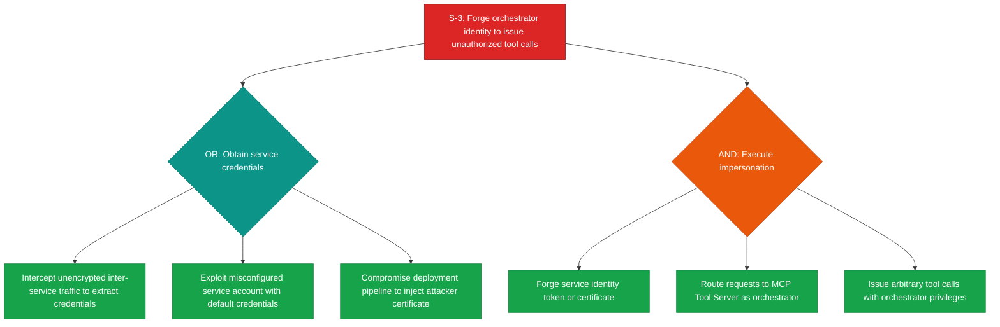
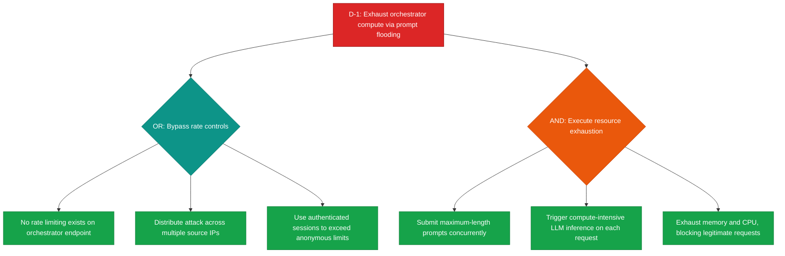
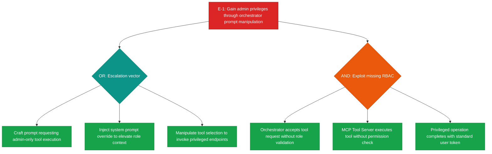
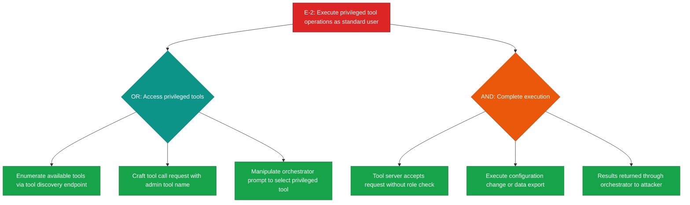
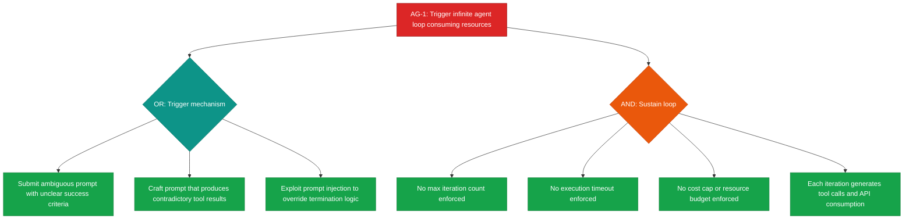
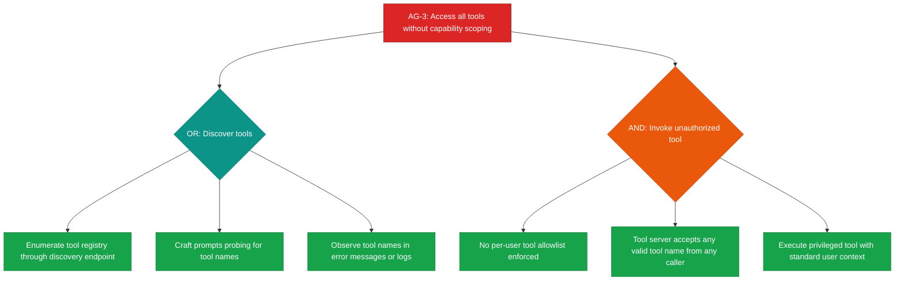
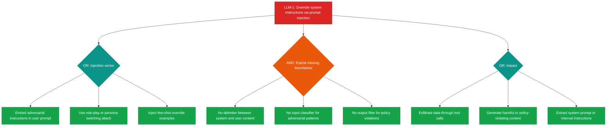

# Threat Report: Agentic AI Application

## 1. Executive Summary

This threat model assesses an agentic AI application comprising seven components organized across three trust zones. The analysis identified **38 findings** across STRIDE (Spoofing, Tampering, Repudiation, Information Disclosure, Denial of Service, Elevation of Privilege) and AI-specific threat categories (Agentic and LLM threats). The risk posture is **elevated**: 7 findings rated Critical and 19 rated High, accounting for 68.4% of all identified threats. The system's two central components — the LLM Agent Orchestrator and the MCP Tool Server — concentrate the majority of risk, collectively representing 21 of 38 findings.

### Top Threats by Business Impact

1. **Unrestricted Agent Autonomy (AG-1, Critical)**: The LLM Agent Orchestrator operates without iteration limits, execution timeouts, or cost caps. An adversary can trigger infinite agent loops that consume API credits, generate unintended tool calls, and block legitimate users. This represents the highest business risk due to direct financial impact and service disruption.

2. **Direct Prompt Injection (LLM-1, Critical)**: User-supplied prompts are concatenated into the LLM context window without structural boundary enforcement. An attacker can override system instructions to exfiltrate data, bypass safety constraints, or produce harmful outputs — threatening both data confidentiality and organizational reputation.

3. **Missing Access Control on Tool Execution (E-2, AG-3, Critical)**: The MCP Tool Server exposes all registered tools to all users without role-based access control. Standard users can execute privileged operations including configuration changes and data exports, creating a direct path to unauthorized data access.

4. **Service Identity Spoofing (S-3, Critical)**: Inter-service authentication between the orchestrator and downstream services is unspecified, enabling an attacker to impersonate the orchestrator and issue unauthorized tool calls or context retrievals.

5. **Resource Exhaustion via Prompt Flooding (D-1, Critical)**: No per-client rate limiting or request size limits protect the orchestrator's LLM inference endpoint, enabling denial-of-service through concurrent maximum-length prompts.

### Key Recommendations

1. **Implement agent runtime constraints immediately**: Add maximum iteration counts, execution timeouts, and per-request cost caps to the LLM Agent Orchestrator before deployment.
2. **Deploy role-based access control across all tool endpoints**: Enforce per-user tool allowlists at the MCP Tool Server and propagate user authorization context from the orchestrator.
3. **Establish inter-service authentication**: Implement mutual TLS (mTLS) with certificate pinning between all application zone components.
4. **Add prompt boundary enforcement**: Implement structured prompt templates with explicit delimiters between system instructions and user input, plus input classifiers for adversarial patterns.
5. **Deploy rate limiting at the system entry point**: Add per-client rate limits, request size caps, and backpressure mechanisms at the Guardrails Service and orchestrator endpoints.

### Compliance Relevance

- **SOC2 CC6.1 (Access Controls)**: Findings E-1, E-2, AG-3 identify missing access control enforcement on the orchestrator and tool server — directly relevant to logical access controls over information assets.
- **SOC2 CC7.2 (System Monitoring)**: Findings R-2, R-4 identify gaps in decision chain logging — directly relevant to monitoring system components for anomalies.
- **ISO 27001 A.9 (Access Control)**: Findings E-1, E-2, E-4 map to access control policy requirements for information systems.
- **OWASP A01:2021**: Findings E-1, E-2, I-3, I-4 correspond to Broken Access Control (CWE-269, CWE-200).
- **OWASP A07:2021**: Findings S-1, S-2, S-3, S-4 correspond to Identification and Authentication Failures (CWE-287).
- **OWASP LLM01:2025**: Findings LLM-1, LLM-2 correspond to Prompt Injection.

### Remediation Timeline

| Priority | Tier | Findings | Action |
|----------|------|----------|--------|
| Immediate | Critical | S-3, D-1, E-1, E-2, AG-1, AG-3, LLM-1 | Address before next deployment |
| Short-term | High | S-1, S-2, S-4, T-1, T-2, T-3, T-4, T-5, R-2, R-4, I-2, I-3, I-4, D-2, D-4, AG-2, LLM-2, LLM-3, E-4 | Address within current development cycle |
| Medium-term | Medium | S-5, T-6, R-1, R-3, I-1, I-5, D-3, D-5, E-3, AG-4, LLM-4 | Schedule for next planning cycle |
| Backlog | Low | R-5 | Track for future consideration |

---

## 2. Architecture Overview

### System Context

The agentic AI application is a multi-component system designed to process user prompts through an LLM-powered pipeline with tool execution capabilities. The system consists of seven components organized into three functional groups:

**User-facing services**: The **User** (external entity) submits prompts and queries over HTTPS to the **Guardrails Service**, which validates and filters input before forwarding approved prompts to the core processing layer. Rejected prompts are returned to the user with a reason.

**Core processing layer**: The **LLM Agent Orchestrator** serves as the central coordination hub, receiving validated prompts from the Guardrails Service, performing context retrieval via vector search against the **Knowledge Base** (a vector database storing documents for semantic search), executing tool calls via JSON-RPC against the **MCP Tool Server**, and returning responses to the user over HTTPS. The MCP Tool Server interfaces with the **External API** (a third-party service) over HTTPS.

**Supporting infrastructure**: The **Audit Logger** receives decision log entries from the orchestrator, tool execution logs from the MCP Tool Server, and filtering event logs from the Guardrails Service, serving as the centralized audit trail.

**Technology stack**: The system uses HTTPS for external communication, JSON-RPC for orchestrator-to-tool-server communication, vector search for context retrieval, and the Model Context Protocol (MCP) for tool invocation.

### Trust Boundary Summary

Three trust zones are defined in the architecture:

- **User Zone** (Untrusted): Contains the User. All input from this zone must be treated as potentially malicious.
- **Application Zone** (Trusted): Contains the Guardrails Service, LLM Agent Orchestrator, MCP Tool Server, Knowledge Base, and Audit Logger. Components within this zone communicate over internal channels.
- **External Services** (Semi-Trusted): Contains the External API. Responses from this zone should be validated before processing.

**Boundary crossings**:
- **User-to-Application**: User prompts cross from the untrusted zone to the application zone via HTTPS, with Guardrails input validation as the security control.
- **Application-to-External**: Tool server requests cross from the trusted zone to the semi-trusted zone via HTTPS.
- **Application-to-User**: Orchestrator responses and Guardrails rejections cross back to the untrusted zone.

A notable concern is that internal communication within the Application Zone (Guardrails-to-Orchestrator, Orchestrator-to-ToolServer, all-to-AuditLogger) lacks specified authentication or integrity protection mechanisms, despite containing sensitive data.

---

## 3. Threat Analysis

### 3.1 Spoofing (S)

Spoofing threats target the system's identity verification mechanisms, enabling attackers to impersonate legitimate users or services. Five spoofing findings were identified.

**S-1** (User, High): An attacker may steal or forge user authentication credentials to impersonate a legitimate user. Without multi-factor authentication or token-binding mechanisms, session tokens alone provide insufficient identity assurance at the system entry point. This is particularly concerning given the consequential actions available through the agentic pipeline — tool execution, data retrieval, and external API calls.

**S-2** (Guardrails Service, High): The Guardrails Service can be bypassed entirely if an attacker spoofs inter-service identity to directly access the orchestrator. Without mutual authentication between internal services, the guardrails filtering layer becomes an optional control rather than an enforced gate.

**S-3** (LLM Agent Orchestrator, Critical): This is the highest-severity spoofing finding. The orchestrator communicates with the MCP Tool Server and Knowledge Base without specified inter-service authentication. An attacker who forges the orchestrator's identity gains the ability to issue arbitrary tool calls and context retrievals — effectively assuming full control of the agentic pipeline.

**S-4** (MCP Tool Server, High): Similar to S-3 but targeting the tool server's identity. An attacker who spoofs the MCP Tool Server can intercept tool call requests or return malicious tool results to the orchestrator.

**S-5** (External API, Medium): DNS spoofing or man-in-the-middle attacks could redirect outbound API requests to attacker-controlled endpoints. While HTTPS provides transport encryption, certificate validation and pinning are not specified.

### 3.2 Tampering (T)

Tampering threats target data integrity across the system's data flows and storage. Six tampering findings were identified.

**T-1** (Guardrails Service, High): If an attacker tampers with the Guardrails validation rules, they can weaken or disable input screening, allowing malicious prompts to pass through. This undermines the entire input filtering defense layer.

**T-2** (LLM Agent Orchestrator, High): The data flow between the Guardrails Service and orchestrator lacks integrity protection. An attacker positioned on the internal network could modify validated prompts after filtering but before processing — effectively bypassing guardrails while maintaining the appearance of filtered input. This finding is correlated with LLM-3 (data poisoning) as part of **CG-1**, as both exploit data integrity weaknesses in the orchestrator's input chain.

**T-3** (MCP Tool Server, High): JSON-RPC messages between the orchestrator and tool server can be tampered with to alter tool parameters or inject malicious payloads, potentially causing the tool server to execute unintended operations against the External API.

**T-4** (Knowledge Base, High): Document injection or modification in the Knowledge Base corrupts the entire context retrieval pipeline. Since the orchestrator trusts retrieved documents as authoritative context, poisoned documents directly influence LLM output quality.

**T-5** (Audit Logger, High): Log tampering is a critical concern because the Audit Logger is the system's sole source of forensic evidence. If logs can be modified or deleted, an attacker can conceal all traces of malicious activity.

**T-6** (Knowledge Base, Medium): A lower-severity variant of T-4 focusing on adversarial content that modifies vector embeddings to bias retrieval results rather than directly corrupting document content.

### 3.3 Repudiation (R)

Repudiation threats target the system's ability to attribute actions to specific actors. Five repudiation findings were identified.

**R-1** (User, Medium): Users can deny submitting specific prompts that triggered consequential actions, because user-level action attribution may be insufficient for forensic reconstruction.

**R-2** (LLM Agent Orchestrator, High): The orchestrator's decision chain — from user prompt through model reasoning to tool selection and execution — is not comprehensively logged. Without end-to-end decision logging, it is impossible to reconstruct why the orchestrator made a specific tool call or produced a specific response.

**R-3** (Guardrails Service, Medium): Rejection decisions lack sufficient detail to determine which rule triggered a rejection or whether the rejection was correct.

**R-4** (MCP Tool Server, High): Tool execution lacks complete audit context — which agent requested the call, what parameters were sent, and what response was received. This finding is correlated with AG-3 (unscoped tool access) as part of **CG-4**: the combination of unaccountable tool execution with unscoped tool access means privileged operations can be executed and denied without evidence.

**R-5** (External API, Low): Actions performed against the External API cannot be attributed to the originating user because the request chain does not propagate user identity context.

### 3.4 Information Disclosure (I)

Information disclosure threats target data confidentiality. Five findings were identified.

**I-1** (LLM Agent Orchestrator, Medium): Verbose error messages may expose internal system state. This finding is correlated with LLM-1 (prompt injection) as part of **CG-3**: an attacker can use prompt injection to deliberately trigger error conditions and extract the disclosed information, amplifying both threats.

**I-2** (MCP Tool Server, High): The tool server forwards External API responses to the orchestrator without filtering sensitive fields, potentially exposing API keys, internal identifiers, or PII that then enters the LLM context and may surface in user-facing responses.

**I-3** (Knowledge Base, High): Query responses return full document contents including metadata, embedding vectors, and storage identifiers without field-level filtering — exposing internal data structures to the orchestrator and potentially to users via prompt injection.

**I-4** (Audit Logger, High): Log entries contain sensitive data (prompts, PII, credentials, tool parameters) that could be exposed through unauthorized access to log storage.

**I-5** (Guardrails Service, Medium): Rejection responses reveal which validation rule was triggered, enabling iterative prompt refinement to bypass filtering.

### 3.5 Denial of Service (D)

Denial of service threats target system availability. Five findings were identified.

**D-1** (LLM Agent Orchestrator, Critical): The most severe availability threat. Without rate limiting or request size caps, the orchestrator's LLM inference endpoint is vulnerable to resource exhaustion from concurrent maximum-length prompts. LLM inference is compute-intensive, making this a high-leverage attack.

**D-2** (MCP Tool Server, High): Excessive tool calls can exhaust the tool server's connection pool and compute resources. This finding is correlated with AG-4 (tool call depth limits) as part of **CG-5**: the combination of no rate limiting with no depth limits enables cascading resource exhaustion.

**D-3** (Knowledge Base, Medium): Expensive vector similarity searches can be triggered to exhaust database resources.

**D-4** (Guardrails Service, High): The system entry point lacks edge rate limiting, enabling prompt flood attacks that block legitimate users.

**D-5** (Audit Logger, Medium): High-volume logging events can flood the Audit Logger, exhausting storage.

### 3.6 Elevation of Privilege (E)

Elevation of privilege threats target authorization boundaries. Four findings were identified.

**E-1** (LLM Agent Orchestrator, Critical): The orchestrator does not enforce RBAC on which tools or Knowledge Base operations are available per user role. An attacker can manipulate prompt content to trigger privileged operations. This finding is correlated with AG-1 (unbounded autonomy) as part of **CG-2**: combined excessive permissions and unconstrained autonomy create a path to unrestricted system control.

**E-2** (MCP Tool Server, Critical): The tool server lacks per-tool authorization. Standard users can execute privileged operations (configuration changes, data exports, system commands) through the tool interface.

**E-3** (Guardrails Service, Medium): Administrative endpoints on the Guardrails Service could be exploited to modify validation rules.

**E-4** (MCP Tool Server, High): Lateral movement from the tool server to other application zone components is possible through overly broad network policies and shared credentials.

### 3.7 Agentic Threats (AG)

Four agentic threat findings were identified targeting the LLM Agent Orchestrator and MCP Tool Server.

**AG-1** (LLM Agent Orchestrator, Critical): The orchestrator operates as an unbounded agent loop — no maximum iteration count, no execution timeout, no cost cap. This is the foundation of the most dangerous attack scenarios: combined with the missing RBAC (E-1) in correlation group **CG-2**, it enables unrestricted, indefinite privileged operations.

**AG-2** (LLM Agent Orchestrator, High): The system does not distinguish between reversible and irreversible operations, executing consequential actions (data modifications, external API calls) without human approval gates.

**AG-3** (MCP Tool Server, Critical): All registered tools are exposed to all users without per-agent or per-user capability scoping. Combined with insufficient audit context (R-4) in correlation group **CG-4**, this means any user can execute any tool without attribution.

**AG-4** (MCP Tool Server, Medium): No tool call depth or recursion limits exist, enabling cascading tool invocations. Combined with connection pool exhaustion (D-2) in correlation group **CG-5**, this amplifies denial-of-service impact.

### 3.8 LLM Threats (LLM)

Four LLM-specific findings were identified, all targeting the LLM Agent Orchestrator.

**LLM-1** (LLM Agent Orchestrator, Critical): Direct prompt injection — user prompts are concatenated into the context window without boundary enforcement. The most impactful LLM threat, enabling attackers to override system behavior. Correlated with I-1 (information disclosure) in **CG-3**, enabling targeted extraction of system internals.

**LLM-2** (LLM Agent Orchestrator, High): Indirect prompt injection via RAG pipeline — poisoned documents retrieved from the Knowledge Base inject adversarial instructions into the context window.

**LLM-3** (LLM Agent Orchestrator, High): Data poisoning of the Knowledge Base — deliberately incorrect or misleading content is indexed and returned as authoritative context. Correlated with T-2 (data flow tampering) in **CG-1**, as both exploit the orchestrator's data integrity weaknesses.

**LLM-4** (LLM Agent Orchestrator, Medium): Systematic querying of the LLM endpoint to extract model behavior patterns or reconstruct capabilities through distillation.

---

## 4. Cross-Cutting Themes

### Theme 1: Concentrated Risk in LLM Agent Orchestrator

The LLM Agent Orchestrator is the highest-risk component in the system, with 12 findings including 3 Critical-severity threats. As the central coordination hub, it processes all user input, manages the LLM context window, dispatches tool calls, and produces user-facing responses. Every major attack vector — prompt injection, privilege escalation, resource exhaustion, and inter-service spoofing — converges on this component.

**Contributing findings**: S-3, T-2, R-2, I-1, D-1, E-1, AG-1, AG-2, LLM-1, LLM-2, LLM-3, LLM-4

**Synthesized recommendation**: Prioritize the orchestrator for defense-in-depth: implement agent runtime constraints (iteration limits, timeouts, cost caps), add RBAC for tool and KB access, enforce prompt boundary separation, deploy rate limiting, and establish comprehensive decision logging.

### Theme 2: Absent Inter-Service Authentication

Multiple findings across Spoofing, Tampering, and Information Disclosure categories identify the absence of mutual authentication and message integrity protection between application zone components. Without mTLS and message signing, internal data flows are vulnerable to interception and modification despite being within the "trusted" zone.

**Contributing findings**: S-2, S-3, S-4, T-2, T-3

**Synthesized recommendation**: Deploy mTLS with certificate pinning between all application zone components (Guardrails-Orchestrator, Orchestrator-ToolServer, Orchestrator-KB). Add HMAC message signing on all internal data flows. Treat the application zone as zero-trust, not implicitly trusted.

### Theme 3: Missing Access Control Enforcement

The system lacks role-based access control at multiple layers — the orchestrator does not scope tool access by user role, the tool server exposes all tools to all callers, and administrative endpoints are not segmented from user-facing interfaces.

**Contributing findings**: E-1, E-2, E-3, E-4, AG-1, AG-3

**Synthesized recommendation**: Implement end-to-end authorization: authenticate users at the Guardrails Service, propagate user role context through the orchestrator to the tool server, enforce per-tool RBAC at the MCP Tool Server, and segment administrative interfaces.

### Theme 4: Incomplete Audit Trail

Multiple repudiation and information disclosure findings reveal that the system's audit trail has gaps in coverage and insufficient protection. Decision chain logging is incomplete, tool execution context is missing, and the Audit Logger itself is vulnerable to tampering and information exposure.

**Contributing findings**: R-1, R-2, R-3, R-4, R-5, T-5, I-4

**Synthesized recommendation**: Implement end-to-end structured audit logging with correlation IDs linking user prompts through orchestrator decisions to tool executions and external API calls. Store logs in append-only immutable storage with cryptographic integrity. Encrypt sensitive log fields.

---

## 5. Attack Trees

Attack trees are provided for all Critical and High findings. Each tree decomposes the attack goal into prerequisite conditions, attack vectors, and exploitation paths using AND/OR gate logic.

### S-3: Service Identity Spoofing on LLM Agent Orchestrator (Critical)

### D-1: Resource Exhaustion on LLM Agent Orchestrator (Critical)

### E-1: Privilege Escalation via Orchestrator (Critical)

### E-2: Privilege Escalation via MCP Tool Server (Critical)

### AG-1: Unbounded Agent Loop (Critical)

### AG-3: Unscoped Tool Access on MCP Tool Server (Critical)

### LLM-1: Direct Prompt Injection (Critical)

*Attack trees for High findings (S-1, S-2, S-4, T-1, T-2, T-3, T-4, T-5, R-2, R-4, I-2, I-3, I-4, D-2, D-4, AG-2, LLM-2, LLM-3, E-4) are provided as standalone files in the `attack-trees/` directory.*

---

## 6. Remediation Roadmap

The remediation roadmap preserves mitigation text verbatim from the threat model findings and organizes actions by priority tier.

### Immediate (Critical — Before Next Deployment)

| Finding | Component | Mitigation | Effort |
|---------|-----------|------------|--------|
| S-3 | LLM Agent Orchestrator | Implement mTLS with certificate pinning between the LLM Agent Orchestrator and all downstream services (MCP Tool Server, Knowledge Base); use signed JWTs with RS256 and audience restriction for service-to-service authentication | High |
| D-1 | LLM Agent Orchestrator | Enforce per-client rate limiting (10 requests/minute); cap prompt input at 4,096 tokens; configure request timeout at 30 seconds; set memory limit per worker with OOM-kill restart policy; implement circuit breaker after 5 consecutive failures | Medium |
| E-1 | LLM Agent Orchestrator | Implement RBAC policy on the orchestrator that maps each user role to permitted tool categories and Knowledge Base access scopes; validate caller role before dispatching any tool call or context retrieval; reject unauthorized operations with 403 and log the attempt | High |
| E-2 | MCP Tool Server | Implement per-tool RBAC policy on the MCP Tool Server that maps each tool endpoint to required permissions; validate the calling agent's authorization context (propagated from the authenticated user) before tool execution; maintain a tool permission manifest defining access tiers | High |
| AG-1 | LLM Agent Orchestrator | Implement mandatory termination constraints: maximum iteration count (25 iterations), execution timeout (5 minutes), and cumulative cost cap per request; add circuit breaker that halts execution if the agent repeats the same action pattern for 3 consecutive iterations | Medium |
| AG-3 | MCP Tool Server | Implement per-user tool allowlists at the MCP Tool Server; scope available tools based on the authenticated user's role propagated from the orchestrator; log all tool invocations with user identity and tool name for audit | Medium |
| LLM-1 | LLM Agent Orchestrator | Implement structured prompt templates with explicit delimiter tokens between system instructions and user input; add an input classifier that detects adversarial prompt patterns before forwarding to the model; apply output filtering to detect responses that violate behavior boundaries | High |

### Short-term (High — Current Development Cycle)

| Finding | Component | Mitigation | Effort |
|---------|-----------|------------|--------|
| S-1 | User | Implement multi-factor authentication for user sessions; bind session tokens to client fingerprints (IP, TLS certificate, device ID) using DPoP or certificate-bound tokens; enforce token expiration with sliding window of 15 minutes | Medium |
| S-2 | Guardrails Service | Enforce mutual TLS (mTLS) between the Guardrails Service and LLM Agent Orchestrator; validate service identity certificates on every request; reject any request to the orchestrator that does not originate from the authenticated Guardrails Service | Medium |
| S-4 | MCP Tool Server | Implement service identity verification using mTLS certificates for the MCP Tool Server; pin the server certificate in the orchestrator's configuration; validate server identity on every JSON-RPC connection | Medium |
| T-1 | Guardrails Service | Store Guardrails configuration in immutable, version-controlled storage with cryptographic integrity checks (SHA-256 checksums); implement change detection with alerts on any configuration modification; require multi-party approval for rule changes | Medium |
| T-2 | LLM Agent Orchestrator | Sign validated prompts with HMAC-SHA256 at the Guardrails Service; verify signature at the LLM Agent Orchestrator before processing; reject any request with an invalid or missing signature | Low |
| T-3 | MCP Tool Server | Implement message-level integrity protection (HMAC signatures) on all JSON-RPC messages between the orchestrator and tool server; validate message integrity before processing; enforce strict JSON schema validation on tool call parameters | Low |
| T-4 | Knowledge Base | Implement write access controls restricting Knowledge Base modifications to authorized administrative roles only; enforce integrity checksums (SHA-256) on all stored documents; maintain an immutable audit trail of all document changes with author attribution | Medium |
| T-5 | Audit Logger | Store audit logs in append-only, immutable storage (write-once-read-many); implement cryptographic log chaining (hash chain) where each entry includes the hash of the previous entry; forward logs to an external SIEM within 60 seconds for independent verification | Medium |
| R-2 | LLM Agent Orchestrator | Implement structured decision logging in the orchestrator that records: authenticated user ID, input prompt hash, model reasoning summary, tool selection rationale, tool call parameters, tool response summary, and final output; forward all decision logs to the Audit Logger within 60 seconds | Medium |
| R-4 | MCP Tool Server | Implement comprehensive tool execution logging that records: requesting agent identity, tool name, full parameter payload, external API endpoint, response status code, response body hash, execution duration, and UTC timestamp; forward to Audit Logger with correlation ID linking to the originating orchestrator decision | Medium |
| I-2 | MCP Tool Server | Implement response filtering at the MCP Tool Server that strips sensitive fields (credentials, internal identifiers, PII patterns) from External API responses before returning tool results to the orchestrator; define an allowlist of permitted response fields per tool | Medium |
| I-3 | Knowledge Base | Implement field-level projection on Knowledge Base query responses to return only content fields required by the orchestrator; strip internal metadata, embedding vectors, and storage identifiers from all query responses | Low |
| I-4 | Audit Logger | Encrypt audit log entries at rest using AES-256; implement field-level encryption for sensitive data within log entries (prompt content, user PII, credentials); enforce role-based access control on log storage with principle of least privilege; mask sensitive fields in log viewing interfaces | Medium |
| D-2 | MCP Tool Server | Implement per-request tool call limits (maximum 10 tool calls per orchestrator request); enforce tool server connection pool limits with timeouts; implement backpressure signaling from tool server to orchestrator when capacity threshold is reached | Low |
| D-4 | Guardrails Service | Deploy rate limiting at the network edge before the Guardrails Service (API gateway or WAF); implement per-IP and per-session rate limits; add request size limits; deploy horizontal scaling with auto-scale triggers based on queue depth | Medium |
| AG-2 | LLM Agent Orchestrator | Classify tool operations into tiers: Tier 1 (read-only, auto-approve), Tier 2 (reversible writes, require confirmation), Tier 3 (irreversible actions, require human approval with mandatory wait period); implement pre-execution review for Tier 2 and Tier 3 actions | High |
| LLM-2 | LLM Agent Orchestrator | Sanitize retrieved document content before injection into the prompt context; implement provenance tracking so the model can distinguish system instructions from retrieved content; apply content integrity checks on uploaded documents and monitor for embedded instruction patterns | Medium |
| LLM-3 | LLM Agent Orchestrator | Implement content validation and adversarial content detection on all documents before indexing in the Knowledge Base; apply document-level access controls; add provenance metadata for source trustworthiness scoring; monitor retrieval patterns for anomalous document frequency | Medium |
| E-4 | MCP Tool Server | Implement network segmentation with per-service firewall rules limiting the MCP Tool Server's outbound connections to only the External API and Audit Logger; use unique service credentials per component; enforce zero-trust network policies within the application zone | Medium |

---

## 7. Appendix: Finding Reference

| Finding ID | Category | Component | Risk Level |
|------------|----------|-----------|------------|
| S-1 | Spoofing | User | High |
| S-2 | Spoofing | Guardrails Service | High |
| S-3 | Spoofing | LLM Agent Orchestrator | Critical |
| S-4 | Spoofing | MCP Tool Server | High |
| S-5 | Spoofing | External API | Medium |
| T-1 | Tampering | Guardrails Service | High |
| T-2 | Tampering | LLM Agent Orchestrator | High |
| T-3 | Tampering | MCP Tool Server | High |
| T-4 | Tampering | Knowledge Base | High |
| T-5 | Tampering | Audit Logger | High |
| T-6 | Tampering | Knowledge Base | Medium |
| R-1 | Repudiation | User | Medium |
| R-2 | Repudiation | LLM Agent Orchestrator | High |
| R-3 | Repudiation | Guardrails Service | Medium |
| R-4 | Repudiation | MCP Tool Server | High |
| R-5 | Repudiation | External API | Low |
| I-1 | Information Disclosure | LLM Agent Orchestrator | Medium |
| I-2 | Information Disclosure | MCP Tool Server | High |
| I-3 | Information Disclosure | Knowledge Base | High |
| I-4 | Information Disclosure | Audit Logger | High |
| I-5 | Information Disclosure | Guardrails Service | Medium |
| D-1 | Denial of Service | LLM Agent Orchestrator | Critical |
| D-2 | Denial of Service | MCP Tool Server | High |
| D-3 | Denial of Service | Knowledge Base | Medium |
| D-4 | Denial of Service | Guardrails Service | High |
| D-5 | Denial of Service | Audit Logger | Medium |
| E-1 | Elevation of Privilege | LLM Agent Orchestrator | Critical |
| E-2 | Elevation of Privilege | MCP Tool Server | Critical |
| E-3 | Elevation of Privilege | Guardrails Service | Medium |
| E-4 | Elevation of Privilege | MCP Tool Server | High |
| AG-1 | Agentic | LLM Agent Orchestrator | Critical |
| AG-2 | Agentic | LLM Agent Orchestrator | High |
| AG-3 | Agentic | MCP Tool Server | Critical |
| AG-4 | Agentic | MCP Tool Server | Medium |
| LLM-1 | LLM | LLM Agent Orchestrator | Critical |
| LLM-2 | LLM | LLM Agent Orchestrator | High |
| LLM-3 | LLM | LLM Agent Orchestrator | High |
| LLM-4 | LLM | LLM Agent Orchestrator | Medium |
