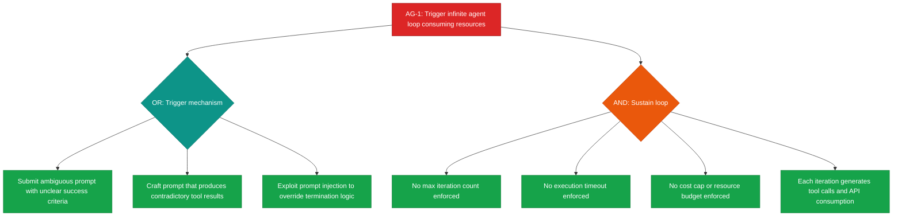

# Attack Tree: AG-1 — Unbounded Agent Loop

```mermaid
flowchart TD
    AG1_root["AG-1: Trigger infinite agent loop consuming resources"]
    AG1_or1{"OR: Trigger mechanism"}
    AG1_leaf1["Submit ambiguous prompt with unclear success criteria"]
    AG1_leaf2["Craft prompt that produces contradictory tool results"]
    AG1_leaf3["Exploit prompt injection to override termination logic"]
    AG1_and1{"AND: Sustain loop"}
    AG1_leaf4["No max iteration count enforced"]
    AG1_leaf5["No execution timeout enforced"]
    AG1_leaf6["No cost cap or resource budget enforced"]
    AG1_leaf7["Each iteration generates tool calls and API consumption"]

    AG1_root --> AG1_or1
    AG1_root --> AG1_and1
    AG1_or1 --> AG1_leaf1
    AG1_or1 --> AG1_leaf2
    AG1_or1 --> AG1_leaf3
    AG1_and1 --> AG1_leaf4
    AG1_and1 --> AG1_leaf5
    AG1_and1 --> AG1_leaf6
    AG1_and1 --> AG1_leaf7

    classDef goal fill:#DC2626,color:#fff,stroke:#991B1B
    classDef andGate fill:#EA580C,color:#fff,stroke:#C2410C
    classDef orGate fill:#0D9488,color:#fff,stroke:#0F766E
    classDef leaf fill:#16A34A,color:#fff,stroke:#15803D
    class AG1_root goal
    class AG1_and1 andGate
    class AG1_or1 orGate
    class AG1_leaf1,AG1_leaf2,AG1_leaf3,AG1_leaf4,AG1_leaf5,AG1_leaf6,AG1_leaf7 leaf
```
