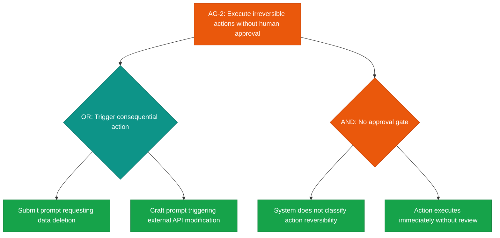

# Attack Tree: AG-2 — Consequential Actions Without Approval

```mermaid
flowchart TD
    AG2_root["AG-2: Execute irreversible actions without human approval"]
    AG2_or1{"OR: Trigger consequential action"}
    AG2_leaf1["Submit prompt requesting data deletion"]
    AG2_leaf2["Craft prompt triggering external API modification"]
    AG2_and1{"AND: No approval gate"}
    AG2_leaf3["System does not classify action reversibility"]
    AG2_leaf4["Action executes immediately without review"]

    AG2_root --> AG2_or1
    AG2_root --> AG2_and1
    AG2_or1 --> AG2_leaf1
    AG2_or1 --> AG2_leaf2
    AG2_and1 --> AG2_leaf3
    AG2_and1 --> AG2_leaf4

    classDef goal fill:#EA580C,color:#fff,stroke:#C2410C
    classDef andGate fill:#EA580C,color:#fff,stroke:#C2410C
    classDef orGate fill:#0D9488,color:#fff,stroke:#0F766E
    classDef leaf fill:#16A34A,color:#fff,stroke:#15803D
    class AG2_root goal
    class AG2_and1 andGate
    class AG2_or1 orGate
    class AG2_leaf1,AG2_leaf2,AG2_leaf3,AG2_leaf4 leaf
```
