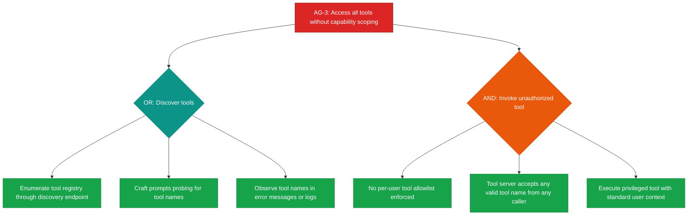

# Attack Tree: AG-3 — Unscoped Tool Access on MCP Tool Server

```mermaid
flowchart TD
    AG3_root["AG-3: Access all tools without capability scoping"]
    AG3_or1{"OR: Discover tools"}
    AG3_leaf1["Enumerate tool registry through discovery endpoint"]
    AG3_leaf2["Craft prompts probing for tool names"]
    AG3_leaf3["Observe tool names in error messages or logs"]
    AG3_and1{"AND: Invoke unauthorized tool"}
    AG3_leaf4["No per-user tool allowlist enforced"]
    AG3_leaf5["Tool server accepts any valid tool name from any caller"]
    AG3_leaf6["Execute privileged tool with standard user context"]

    AG3_root --> AG3_or1
    AG3_root --> AG3_and1
    AG3_or1 --> AG3_leaf1
    AG3_or1 --> AG3_leaf2
    AG3_or1 --> AG3_leaf3
    AG3_and1 --> AG3_leaf4
    AG3_and1 --> AG3_leaf5
    AG3_and1 --> AG3_leaf6

    classDef goal fill:#DC2626,color:#fff,stroke:#991B1B
    classDef andGate fill:#EA580C,color:#fff,stroke:#C2410C
    classDef orGate fill:#0D9488,color:#fff,stroke:#0F766E
    classDef leaf fill:#16A34A,color:#fff,stroke:#15803D
    class AG3_root goal
    class AG3_and1 andGate
    class AG3_or1 orGate
    class AG3_leaf1,AG3_leaf2,AG3_leaf3,AG3_leaf4,AG3_leaf5,AG3_leaf6 leaf
```
