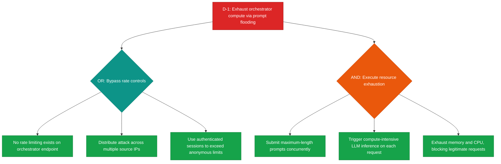

# Attack Tree: D-1 — Resource Exhaustion on LLM Agent Orchestrator

```mermaid
flowchart TD
    D1_root["D-1: Exhaust orchestrator compute via prompt flooding"]
    D1_or1{"OR: Bypass rate controls"}
    D1_leaf1["No rate limiting exists on orchestrator endpoint"]
    D1_leaf2["Distribute attack across multiple source IPs"]
    D1_leaf3["Use authenticated sessions to exceed anonymous limits"]
    D1_and1{"AND: Execute resource exhaustion"}
    D1_leaf4["Submit maximum-length prompts concurrently"]
    D1_leaf5["Trigger compute-intensive LLM inference on each request"]
    D1_leaf6["Exhaust memory and CPU, blocking legitimate requests"]

    D1_root --> D1_or1
    D1_root --> D1_and1
    D1_or1 --> D1_leaf1
    D1_or1 --> D1_leaf2
    D1_or1 --> D1_leaf3
    D1_and1 --> D1_leaf4
    D1_and1 --> D1_leaf5
    D1_and1 --> D1_leaf6

    classDef goal fill:#DC2626,color:#fff,stroke:#991B1B
    classDef andGate fill:#EA580C,color:#fff,stroke:#C2410C
    classDef orGate fill:#0D9488,color:#fff,stroke:#0F766E
    classDef leaf fill:#16A34A,color:#fff,stroke:#15803D
    class D1_root goal
    class D1_and1 andGate
    class D1_or1 orGate
    class D1_leaf1,D1_leaf2,D1_leaf3,D1_leaf4,D1_leaf5,D1_leaf6 leaf
```
