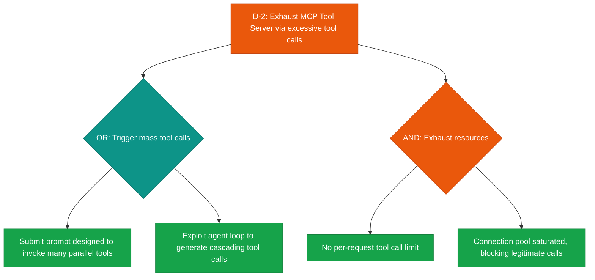

# Attack Tree: D-2 — Tool Server Connection Pool Exhaustion

```mermaid
flowchart TD
    D2_root["D-2: Exhaust MCP Tool Server via excessive tool calls"]
    D2_or1{"OR: Trigger mass tool calls"}
    D2_leaf1["Submit prompt designed to invoke many parallel tools"]
    D2_leaf2["Exploit agent loop to generate cascading tool calls"]
    D2_and1{"AND: Exhaust resources"}
    D2_leaf3["No per-request tool call limit"]
    D2_leaf4["Connection pool saturated, blocking legitimate calls"]

    D2_root --> D2_or1
    D2_root --> D2_and1
    D2_or1 --> D2_leaf1
    D2_or1 --> D2_leaf2
    D2_and1 --> D2_leaf3
    D2_and1 --> D2_leaf4

    classDef goal fill:#EA580C,color:#fff,stroke:#C2410C
    classDef andGate fill:#EA580C,color:#fff,stroke:#C2410C
    classDef orGate fill:#0D9488,color:#fff,stroke:#0F766E
    classDef leaf fill:#16A34A,color:#fff,stroke:#15803D
    class D2_root goal
    class D2_and1 andGate
    class D2_or1 orGate
    class D2_leaf1,D2_leaf2,D2_leaf3,D2_leaf4 leaf
```
