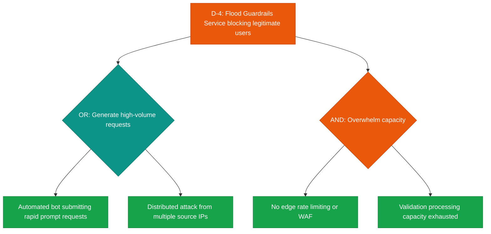

# Attack Tree: D-4 — Guardrails Service Prompt Flood

```mermaid
flowchart TD
    D4_root["D-4: Flood Guardrails Service blocking legitimate users"]
    D4_or1{"OR: Generate high-volume requests"}
    D4_leaf1["Automated bot submitting rapid prompt requests"]
    D4_leaf2["Distributed attack from multiple source IPs"]
    D4_and1{"AND: Overwhelm capacity"}
    D4_leaf3["No edge rate limiting or WAF"]
    D4_leaf4["Validation processing capacity exhausted"]

    D4_root --> D4_or1
    D4_root --> D4_and1
    D4_or1 --> D4_leaf1
    D4_or1 --> D4_leaf2
    D4_and1 --> D4_leaf3
    D4_and1 --> D4_leaf4

    classDef goal fill:#EA580C,color:#fff,stroke:#C2410C
    classDef andGate fill:#EA580C,color:#fff,stroke:#C2410C
    classDef orGate fill:#0D9488,color:#fff,stroke:#0F766E
    classDef leaf fill:#16A34A,color:#fff,stroke:#15803D
    class D4_root goal
    class D4_and1 andGate
    class D4_or1 orGate
    class D4_leaf1,D4_leaf2,D4_leaf3,D4_leaf4 leaf
```
