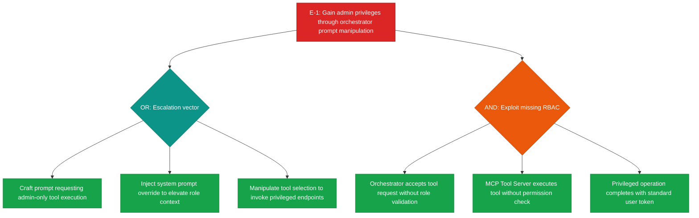

# Attack Tree: E-1 — Privilege Escalation via Orchestrator

```mermaid
flowchart TD
    E1_root["E-1: Gain admin privileges through orchestrator prompt manipulation"]
    E1_or1{"OR: Escalation vector"}
    E1_leaf1["Craft prompt requesting admin-only tool execution"]
    E1_leaf2["Inject system prompt override to elevate role context"]
    E1_leaf3["Manipulate tool selection to invoke privileged endpoints"]
    E1_and1{"AND: Exploit missing RBAC"}
    E1_leaf4["Orchestrator accepts tool request without role validation"]
    E1_leaf5["MCP Tool Server executes tool without permission check"]
    E1_leaf6["Privileged operation completes with standard user token"]

    E1_root --> E1_or1
    E1_root --> E1_and1
    E1_or1 --> E1_leaf1
    E1_or1 --> E1_leaf2
    E1_or1 --> E1_leaf3
    E1_and1 --> E1_leaf4
    E1_and1 --> E1_leaf5
    E1_and1 --> E1_leaf6

    classDef goal fill:#DC2626,color:#fff,stroke:#991B1B
    classDef andGate fill:#EA580C,color:#fff,stroke:#C2410C
    classDef orGate fill:#0D9488,color:#fff,stroke:#0F766E
    classDef leaf fill:#16A34A,color:#fff,stroke:#15803D
    class E1_root goal
    class E1_and1 andGate
    class E1_or1 orGate
    class E1_leaf1,E1_leaf2,E1_leaf3,E1_leaf4,E1_leaf5,E1_leaf6 leaf
```
