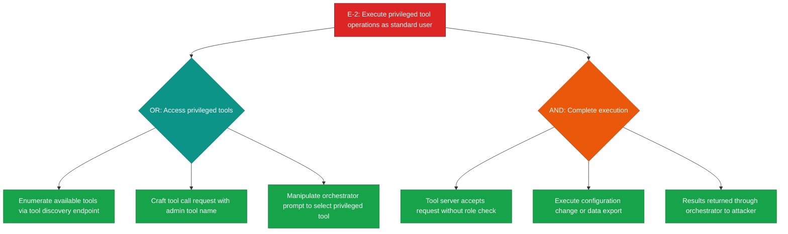

# Attack Tree: E-2 — Privilege Escalation via MCP Tool Server

```mermaid
flowchart TD
    E2_root["E-2: Execute privileged tool operations as standard user"]
    E2_or1{"OR: Access privileged tools"}
    E2_leaf1["Enumerate available tools via tool discovery endpoint"]
    E2_leaf2["Craft tool call request with admin tool name"]
    E2_leaf3["Manipulate orchestrator prompt to select privileged tool"]
    E2_and1{"AND: Complete execution"}
    E2_leaf4["Tool server accepts request without role check"]
    E2_leaf5["Execute configuration change or data export"]
    E2_leaf6["Results returned through orchestrator to attacker"]

    E2_root --> E2_or1
    E2_root --> E2_and1
    E2_or1 --> E2_leaf1
    E2_or1 --> E2_leaf2
    E2_or1 --> E2_leaf3
    E2_and1 --> E2_leaf4
    E2_and1 --> E2_leaf5
    E2_and1 --> E2_leaf6

    classDef goal fill:#DC2626,color:#fff,stroke:#991B1B
    classDef andGate fill:#EA580C,color:#fff,stroke:#C2410C
    classDef orGate fill:#0D9488,color:#fff,stroke:#0F766E
    classDef leaf fill:#16A34A,color:#fff,stroke:#15803D
    class E2_root goal
    class E2_and1 andGate
    class E2_or1 orGate
    class E2_leaf1,E2_leaf2,E2_leaf3,E2_leaf4,E2_leaf5,E2_leaf6 leaf
```
