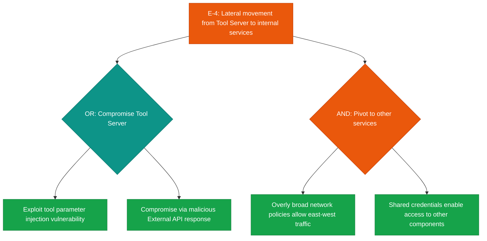

# Attack Tree: E-4 — Lateral Movement from MCP Tool Server

```mermaid
flowchart TD
    E4_root["E-4: Lateral movement from Tool Server to internal services"]
    E4_or1{"OR: Compromise Tool Server"}
    E4_leaf1["Exploit tool parameter injection vulnerability"]
    E4_leaf2["Compromise via malicious External API response"]
    E4_and1{"AND: Pivot to other services"}
    E4_leaf3["Overly broad network policies allow east-west traffic"]
    E4_leaf4["Shared credentials enable access to other components"]

    E4_root --> E4_or1
    E4_root --> E4_and1
    E4_or1 --> E4_leaf1
    E4_or1 --> E4_leaf2
    E4_and1 --> E4_leaf3
    E4_and1 --> E4_leaf4

    classDef goal fill:#EA580C,color:#fff,stroke:#C2410C
    classDef andGate fill:#EA580C,color:#fff,stroke:#C2410C
    classDef orGate fill:#0D9488,color:#fff,stroke:#0F766E
    classDef leaf fill:#16A34A,color:#fff,stroke:#15803D
    class E4_root goal
    class E4_and1 andGate
    class E4_or1 orGate
    class E4_leaf1,E4_leaf2,E4_leaf3,E4_leaf4 leaf
```
