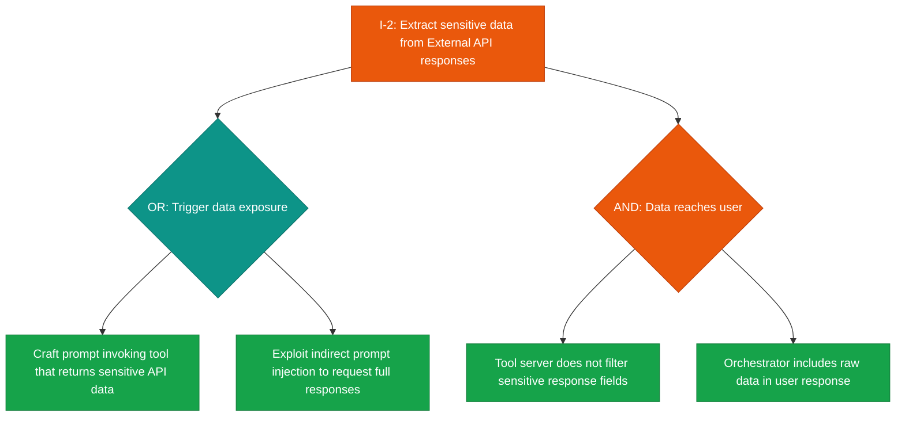

# Attack Tree: I-2 — Sensitive Data Leakage via Tool Server

```mermaid
flowchart TD
    I2_root["I-2: Extract sensitive data from External API responses"]
    I2_or1{"OR: Trigger data exposure"}
    I2_leaf1["Craft prompt invoking tool that returns sensitive API data"]
    I2_leaf2["Exploit indirect prompt injection to request full responses"]
    I2_and1{"AND: Data reaches user"}
    I2_leaf3["Tool server does not filter sensitive response fields"]
    I2_leaf4["Orchestrator includes raw data in user response"]

    I2_root --> I2_or1
    I2_root --> I2_and1
    I2_or1 --> I2_leaf1
    I2_or1 --> I2_leaf2
    I2_and1 --> I2_leaf3
    I2_and1 --> I2_leaf4

    classDef goal fill:#EA580C,color:#fff,stroke:#C2410C
    classDef andGate fill:#EA580C,color:#fff,stroke:#C2410C
    classDef orGate fill:#0D9488,color:#fff,stroke:#0F766E
    classDef leaf fill:#16A34A,color:#fff,stroke:#15803D
    class I2_root goal
    class I2_and1 andGate
    class I2_or1 orGate
    class I2_leaf1,I2_leaf2,I2_leaf3,I2_leaf4 leaf
```
