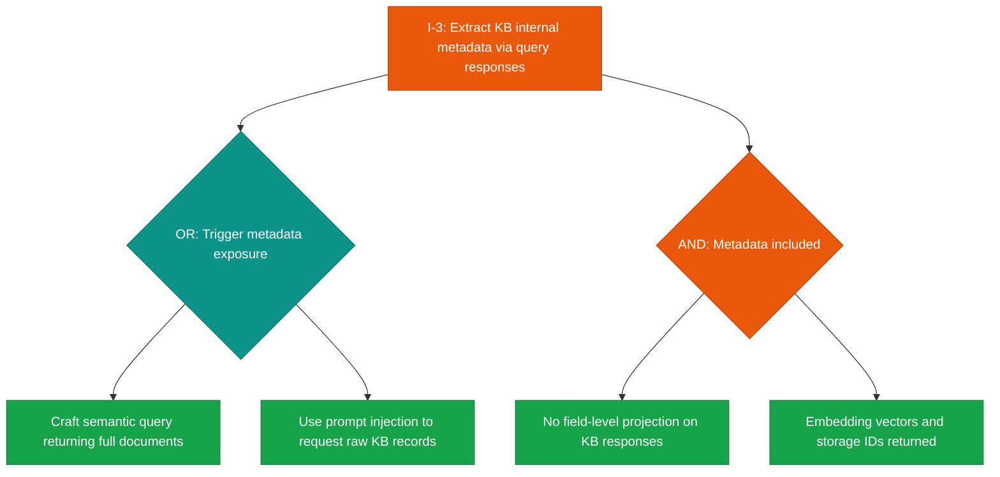

# Attack Tree: I-3 — Knowledge Base Metadata Disclosure

```mermaid
flowchart TD
    I3_root["I-3: Extract KB internal metadata via query responses"]
    I3_or1{"OR: Trigger metadata exposure"}
    I3_leaf1["Craft semantic query returning full documents"]
    I3_leaf2["Use prompt injection to request raw KB records"]
    I3_and1{"AND: Metadata included"}
    I3_leaf3["No field-level projection on KB responses"]
    I3_leaf4["Embedding vectors and storage IDs returned"]

    I3_root --> I3_or1
    I3_root --> I3_and1
    I3_or1 --> I3_leaf1
    I3_or1 --> I3_leaf2
    I3_and1 --> I3_leaf3
    I3_and1 --> I3_leaf4

    classDef goal fill:#EA580C,color:#fff,stroke:#C2410C
    classDef andGate fill:#EA580C,color:#fff,stroke:#C2410C
    classDef orGate fill:#0D9488,color:#fff,stroke:#0F766E
    classDef leaf fill:#16A34A,color:#fff,stroke:#15803D
    class I3_root goal
    class I3_and1 andGate
    class I3_or1 orGate
    class I3_leaf1,I3_leaf2,I3_leaf3,I3_leaf4 leaf
```
