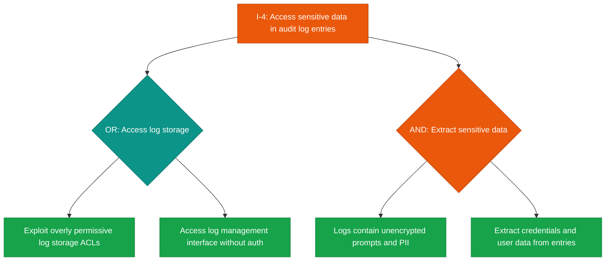

# Attack Tree: I-4 — Audit Log Data Exposure

```mermaid
flowchart TD
    I4_root["I-4: Access sensitive data in audit log entries"]
    I4_or1{"OR: Access log storage"}
    I4_leaf1["Exploit overly permissive log storage ACLs"]
    I4_leaf2["Access log management interface without auth"]
    I4_and1{"AND: Extract sensitive data"}
    I4_leaf3["Logs contain unencrypted prompts and PII"]
    I4_leaf4["Extract credentials and user data from entries"]

    I4_root --> I4_or1
    I4_root --> I4_and1
    I4_or1 --> I4_leaf1
    I4_or1 --> I4_leaf2
    I4_and1 --> I4_leaf3
    I4_and1 --> I4_leaf4

    classDef goal fill:#EA580C,color:#fff,stroke:#C2410C
    classDef andGate fill:#EA580C,color:#fff,stroke:#C2410C
    classDef orGate fill:#0D9488,color:#fff,stroke:#0F766E
    classDef leaf fill:#16A34A,color:#fff,stroke:#15803D
    class I4_root goal
    class I4_and1 andGate
    class I4_or1 orGate
    class I4_leaf1,I4_leaf2,I4_leaf3,I4_leaf4 leaf
```
