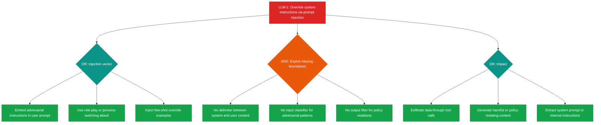

# Attack Tree: LLM-1 — Direct Prompt Injection

```mermaid
flowchart TD
    LLM1_root["LLM-1: Override system instructions via prompt injection"]
    LLM1_or1{"OR: Injection vector"}
    LLM1_leaf1["Embed adversarial instructions in user prompt"]
    LLM1_leaf2["Use role-play or persona-switching attack"]
    LLM1_leaf3["Inject few-shot override examples"]
    LLM1_and1{"AND: Exploit missing boundaries"}
    LLM1_leaf4["No delimiter between system and user content"]
    LLM1_leaf5["No input classifier for adversarial patterns"]
    LLM1_leaf6["No output filter for policy violations"]
    LLM1_or2{"OR: Impact"}
    LLM1_leaf7["Exfiltrate data through tool calls"]
    LLM1_leaf8["Generate harmful or policy-violating content"]
    LLM1_leaf9["Extract system prompt or internal instructions"]

    LLM1_root --> LLM1_or1
    LLM1_root --> LLM1_and1
    LLM1_root --> LLM1_or2
    LLM1_or1 --> LLM1_leaf1
    LLM1_or1 --> LLM1_leaf2
    LLM1_or1 --> LLM1_leaf3
    LLM1_and1 --> LLM1_leaf4
    LLM1_and1 --> LLM1_leaf5
    LLM1_and1 --> LLM1_leaf6
    LLM1_or2 --> LLM1_leaf7
    LLM1_or2 --> LLM1_leaf8
    LLM1_or2 --> LLM1_leaf9

    classDef goal fill:#DC2626,color:#fff,stroke:#991B1B
    classDef andGate fill:#EA580C,color:#fff,stroke:#C2410C
    classDef orGate fill:#0D9488,color:#fff,stroke:#0F766E
    classDef leaf fill:#16A34A,color:#fff,stroke:#15803D
    class LLM1_root goal
    class LLM1_and1 andGate
    class LLM1_or1,LLM1_or2 orGate
    class LLM1_leaf1,LLM1_leaf2,LLM1_leaf3,LLM1_leaf4,LLM1_leaf5,LLM1_leaf6,LLM1_leaf7,LLM1_leaf8,LLM1_leaf9 leaf
```
