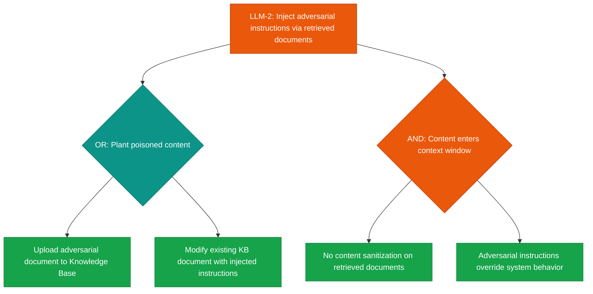

# Attack Tree: LLM-2 — Indirect Prompt Injection via RAG Pipeline

```mermaid
flowchart TD
    LLM2_root["LLM-2: Inject adversarial instructions via retrieved documents"]
    LLM2_or1{"OR: Plant poisoned content"}
    LLM2_leaf1["Upload adversarial document to Knowledge Base"]
    LLM2_leaf2["Modify existing KB document with injected instructions"]
    LLM2_and1{"AND: Content enters context window"}
    LLM2_leaf3["No content sanitization on retrieved documents"]
    LLM2_leaf4["Adversarial instructions override system behavior"]

    LLM2_root --> LLM2_or1
    LLM2_root --> LLM2_and1
    LLM2_or1 --> LLM2_leaf1
    LLM2_or1 --> LLM2_leaf2
    LLM2_and1 --> LLM2_leaf3
    LLM2_and1 --> LLM2_leaf4

    classDef goal fill:#EA580C,color:#fff,stroke:#C2410C
    classDef andGate fill:#EA580C,color:#fff,stroke:#C2410C
    classDef orGate fill:#0D9488,color:#fff,stroke:#0F766E
    classDef leaf fill:#16A34A,color:#fff,stroke:#15803D
    class LLM2_root goal
    class LLM2_and1 andGate
    class LLM2_or1 orGate
    class LLM2_leaf1,LLM2_leaf2,LLM2_leaf3,LLM2_leaf4 leaf
```
