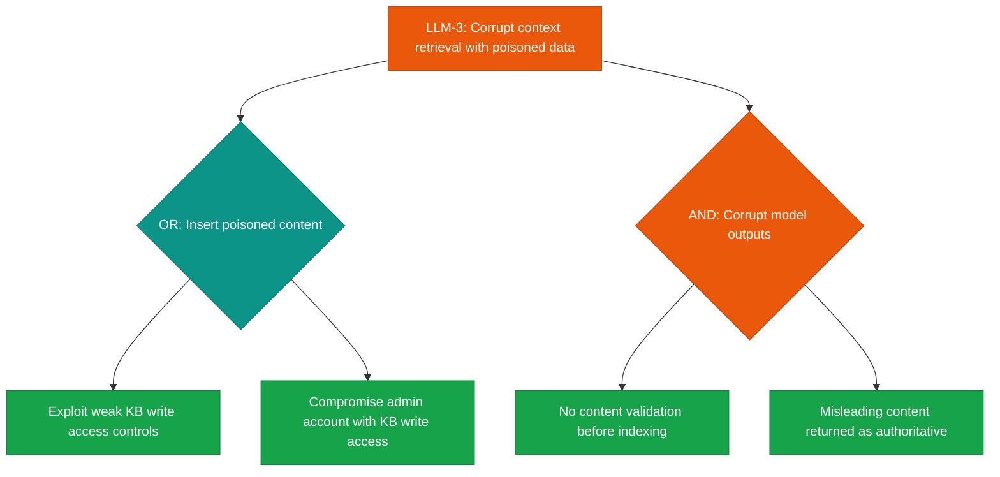

# Attack Tree: LLM-3 — Knowledge Base Data Poisoning

```mermaid
flowchart TD
    LLM3_root["LLM-3: Corrupt context retrieval with poisoned data"]
    LLM3_or1{"OR: Insert poisoned content"}
    LLM3_leaf1["Exploit weak KB write access controls"]
    LLM3_leaf2["Compromise admin account with KB write access"]
    LLM3_and1{"AND: Corrupt model outputs"}
    LLM3_leaf3["No content validation before indexing"]
    LLM3_leaf4["Misleading content returned as authoritative"]

    LLM3_root --> LLM3_or1
    LLM3_root --> LLM3_and1
    LLM3_or1 --> LLM3_leaf1
    LLM3_or1 --> LLM3_leaf2
    LLM3_and1 --> LLM3_leaf3
    LLM3_and1 --> LLM3_leaf4

    classDef goal fill:#EA580C,color:#fff,stroke:#C2410C
    classDef andGate fill:#EA580C,color:#fff,stroke:#C2410C
    classDef orGate fill:#0D9488,color:#fff,stroke:#0F766E
    classDef leaf fill:#16A34A,color:#fff,stroke:#15803D
    class LLM3_root goal
    class LLM3_and1 andGate
    class LLM3_or1 orGate
    class LLM3_leaf1,LLM3_leaf2,LLM3_leaf3,LLM3_leaf4 leaf
```
