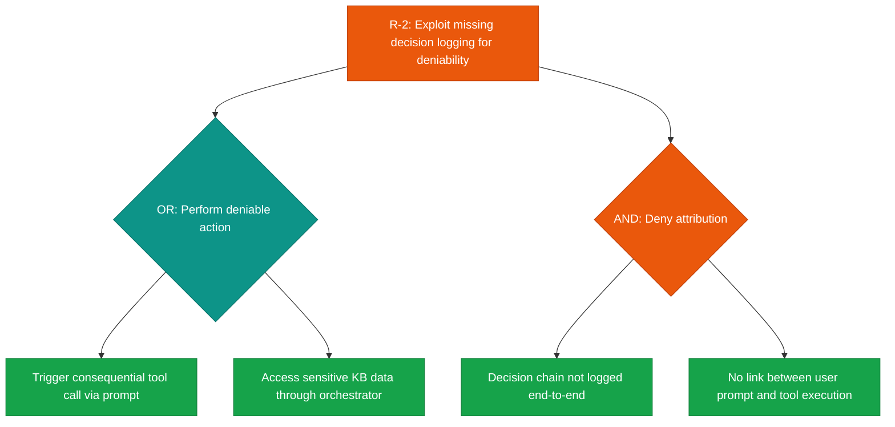

# Attack Tree: R-2 — Incomplete Decision Chain Logging

```mermaid
flowchart TD
    R2_root["R-2: Exploit missing decision logging for deniability"]
    R2_or1{"OR: Perform deniable action"}
    R2_leaf1["Trigger consequential tool call via prompt"]
    R2_leaf2["Access sensitive KB data through orchestrator"]
    R2_and1{"AND: Deny attribution"}
    R2_leaf3["Decision chain not logged end-to-end"]
    R2_leaf4["No link between user prompt and tool execution"]

    R2_root --> R2_or1
    R2_root --> R2_and1
    R2_or1 --> R2_leaf1
    R2_or1 --> R2_leaf2
    R2_and1 --> R2_leaf3
    R2_and1 --> R2_leaf4

    classDef goal fill:#EA580C,color:#fff,stroke:#C2410C
    classDef andGate fill:#EA580C,color:#fff,stroke:#C2410C
    classDef orGate fill:#0D9488,color:#fff,stroke:#0F766E
    classDef leaf fill:#16A34A,color:#fff,stroke:#15803D
    class R2_root goal
    class R2_and1 andGate
    class R2_or1 orGate
    class R2_leaf1,R2_leaf2,R2_leaf3,R2_leaf4 leaf
```
