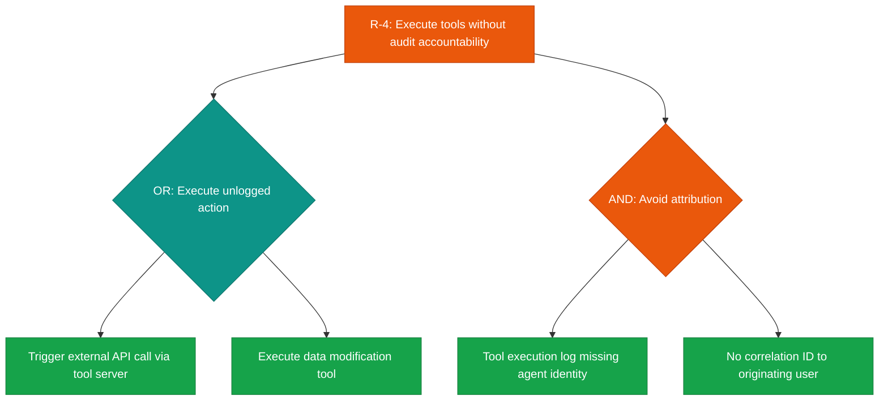

# Attack Tree: R-4 — Unaccountable Tool Execution

```mermaid
flowchart TD
    R4_root["R-4: Execute tools without audit accountability"]
    R4_or1{"OR: Execute unlogged action"}
    R4_leaf1["Trigger external API call via tool server"]
    R4_leaf2["Execute data modification tool"]
    R4_and1{"AND: Avoid attribution"}
    R4_leaf3["Tool execution log missing agent identity"]
    R4_leaf4["No correlation ID to originating user"]

    R4_root --> R4_or1
    R4_root --> R4_and1
    R4_or1 --> R4_leaf1
    R4_or1 --> R4_leaf2
    R4_and1 --> R4_leaf3
    R4_and1 --> R4_leaf4

    classDef goal fill:#EA580C,color:#fff,stroke:#C2410C
    classDef andGate fill:#EA580C,color:#fff,stroke:#C2410C
    classDef orGate fill:#0D9488,color:#fff,stroke:#0F766E
    classDef leaf fill:#16A34A,color:#fff,stroke:#15803D
    class R4_root goal
    class R4_and1 andGate
    class R4_or1 orGate
    class R4_leaf1,R4_leaf2,R4_leaf3,R4_leaf4 leaf
```
