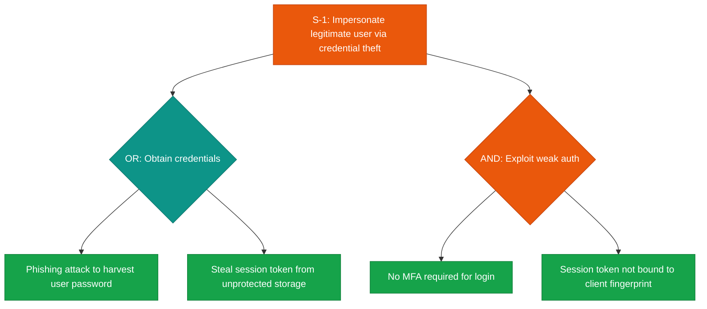

# Attack Tree: S-1 — User Credential Theft and Impersonation

```mermaid
flowchart TD
    S1_root["S-1: Impersonate legitimate user via credential theft"]
    S1_or1{"OR: Obtain credentials"}
    S1_leaf1["Phishing attack to harvest user password"]
    S1_leaf2["Steal session token from unprotected storage"]
    S1_and1{"AND: Exploit weak auth"}
    S1_leaf3["No MFA required for login"]
    S1_leaf4["Session token not bound to client fingerprint"]

    S1_root --> S1_or1
    S1_root --> S1_and1
    S1_or1 --> S1_leaf1
    S1_or1 --> S1_leaf2
    S1_and1 --> S1_leaf3
    S1_and1 --> S1_leaf4

    classDef goal fill:#EA580C,color:#fff,stroke:#C2410C
    classDef andGate fill:#EA580C,color:#fff,stroke:#C2410C
    classDef orGate fill:#0D9488,color:#fff,stroke:#0F766E
    classDef leaf fill:#16A34A,color:#fff,stroke:#15803D
    class S1_root goal
    class S1_and1 andGate
    class S1_or1 orGate
    class S1_leaf1,S1_leaf2,S1_leaf3,S1_leaf4 leaf
```
