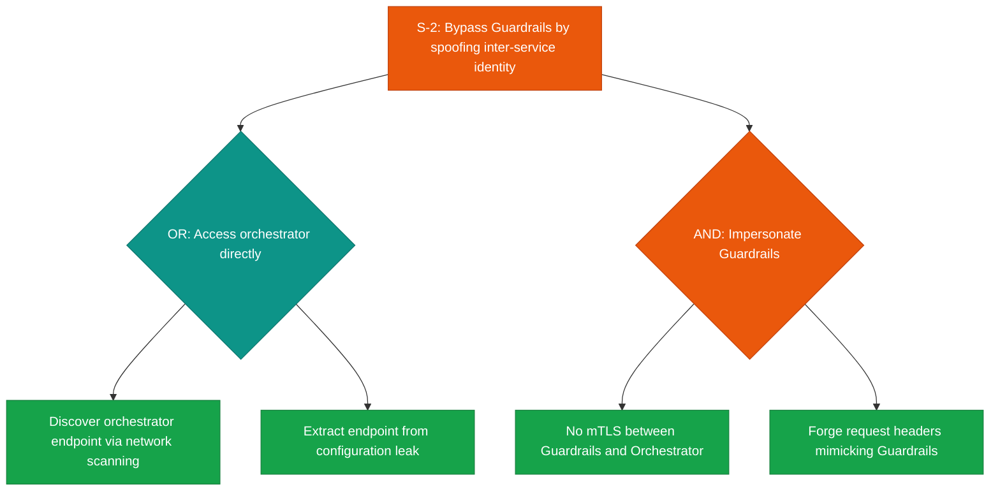

# Attack Tree: S-2 — Guardrails Service Bypass via Identity Spoofing

```mermaid
flowchart TD
    S2_root["S-2: Bypass Guardrails by spoofing inter-service identity"]
    S2_or1{"OR: Access orchestrator directly"}
    S2_leaf1["Discover orchestrator endpoint via network scanning"]
    S2_leaf2["Extract endpoint from configuration leak"]
    S2_and1{"AND: Impersonate Guardrails"}
    S2_leaf3["No mTLS between Guardrails and Orchestrator"]
    S2_leaf4["Forge request headers mimicking Guardrails"]

    S2_root --> S2_or1
    S2_root --> S2_and1
    S2_or1 --> S2_leaf1
    S2_or1 --> S2_leaf2
    S2_and1 --> S2_leaf3
    S2_and1 --> S2_leaf4

    classDef goal fill:#EA580C,color:#fff,stroke:#C2410C
    classDef andGate fill:#EA580C,color:#fff,stroke:#C2410C
    classDef orGate fill:#0D9488,color:#fff,stroke:#0F766E
    classDef leaf fill:#16A34A,color:#fff,stroke:#15803D
    class S2_root goal
    class S2_and1 andGate
    class S2_or1 orGate
    class S2_leaf1,S2_leaf2,S2_leaf3,S2_leaf4 leaf
```
