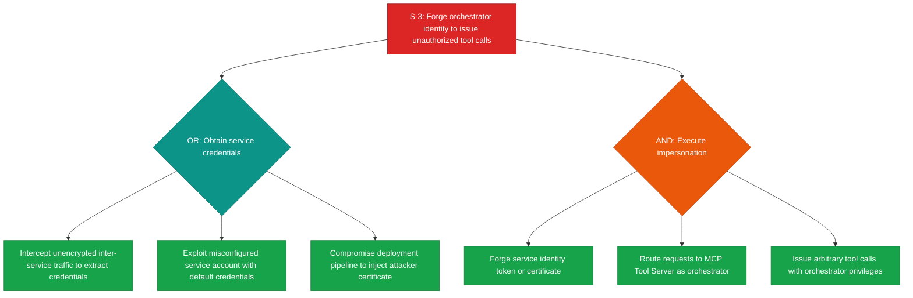

# Attack Tree: S-3 — Service Identity Spoofing on LLM Agent Orchestrator

```mermaid
flowchart TD
    S3_root["S-3: Forge orchestrator identity to issue unauthorized tool calls"]
    S3_or1{"OR: Obtain service credentials"}
    S3_leaf1["Intercept unencrypted inter-service traffic to extract credentials"]
    S3_leaf2["Exploit misconfigured service account with default credentials"]
    S3_leaf3["Compromise deployment pipeline to inject attacker certificate"]
    S3_and1{"AND: Execute impersonation"}
    S3_leaf4["Forge service identity token or certificate"]
    S3_leaf5["Route requests to MCP Tool Server as orchestrator"]
    S3_leaf6["Issue arbitrary tool calls with orchestrator privileges"]

    S3_root --> S3_or1
    S3_root --> S3_and1
    S3_or1 --> S3_leaf1
    S3_or1 --> S3_leaf2
    S3_or1 --> S3_leaf3
    S3_and1 --> S3_leaf4
    S3_and1 --> S3_leaf5
    S3_and1 --> S3_leaf6

    classDef goal fill:#DC2626,color:#fff,stroke:#991B1B
    classDef andGate fill:#EA580C,color:#fff,stroke:#C2410C
    classDef orGate fill:#0D9488,color:#fff,stroke:#0F766E
    classDef leaf fill:#16A34A,color:#fff,stroke:#15803D
    class S3_root goal
    class S3_and1 andGate
    class S3_or1 orGate
    class S3_leaf1,S3_leaf2,S3_leaf3,S3_leaf4,S3_leaf5,S3_leaf6 leaf
```
