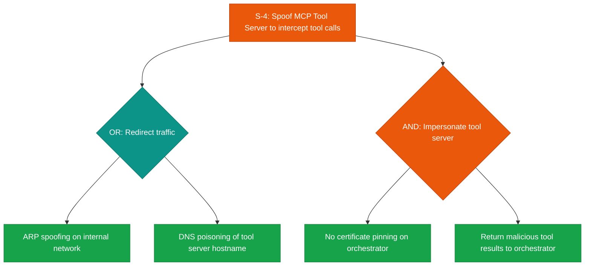

# Attack Tree: S-4 — MCP Tool Server Identity Spoofing

```mermaid
flowchart TD
    S4_root["S-4: Spoof MCP Tool Server to intercept tool calls"]
    S4_or1{"OR: Redirect traffic"}
    S4_leaf1["ARP spoofing on internal network"]
    S4_leaf2["DNS poisoning of tool server hostname"]
    S4_and1{"AND: Impersonate tool server"}
    S4_leaf3["No certificate pinning on orchestrator"]
    S4_leaf4["Return malicious tool results to orchestrator"]

    S4_root --> S4_or1
    S4_root --> S4_and1
    S4_or1 --> S4_leaf1
    S4_or1 --> S4_leaf2
    S4_and1 --> S4_leaf3
    S4_and1 --> S4_leaf4

    classDef goal fill:#EA580C,color:#fff,stroke:#C2410C
    classDef andGate fill:#EA580C,color:#fff,stroke:#C2410C
    classDef orGate fill:#0D9488,color:#fff,stroke:#0F766E
    classDef leaf fill:#16A34A,color:#fff,stroke:#15803D
    class S4_root goal
    class S4_and1 andGate
    class S4_or1 orGate
    class S4_leaf1,S4_leaf2,S4_leaf3,S4_leaf4 leaf
```
