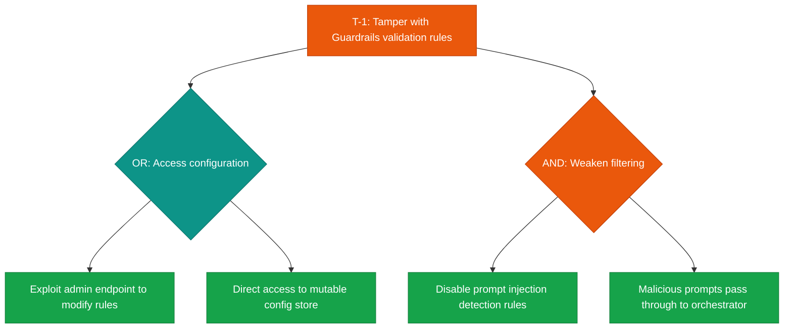

# Attack Tree: T-1 — Guardrails Configuration Tampering

```mermaid
flowchart TD
    T1_root["T-1: Tamper with Guardrails validation rules"]
    T1_or1{"OR: Access configuration"}
    T1_leaf1["Exploit admin endpoint to modify rules"]
    T1_leaf2["Direct access to mutable config store"]
    T1_and1{"AND: Weaken filtering"}
    T1_leaf3["Disable prompt injection detection rules"]
    T1_leaf4["Malicious prompts pass through to orchestrator"]

    T1_root --> T1_or1
    T1_root --> T1_and1
    T1_or1 --> T1_leaf1
    T1_or1 --> T1_leaf2
    T1_and1 --> T1_leaf3
    T1_and1 --> T1_leaf4

    classDef goal fill:#EA580C,color:#fff,stroke:#C2410C
    classDef andGate fill:#EA580C,color:#fff,stroke:#C2410C
    classDef orGate fill:#0D9488,color:#fff,stroke:#0F766E
    classDef leaf fill:#16A34A,color:#fff,stroke:#15803D
    class T1_root goal
    class T1_and1 andGate
    class T1_or1 orGate
    class T1_leaf1,T1_leaf2,T1_leaf3,T1_leaf4 leaf
```
