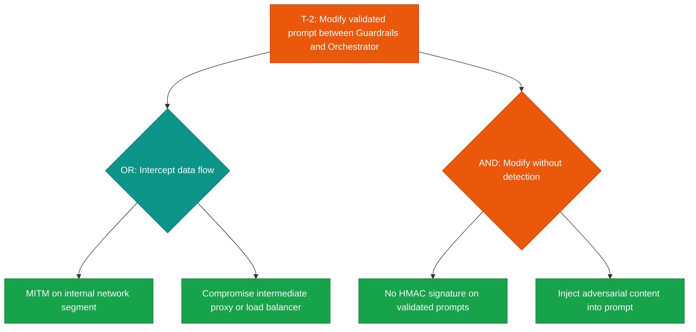

# Attack Tree: T-2 — Prompt Tampering in Transit

```mermaid
flowchart TD
    T2_root["T-2: Modify validated prompt between Guardrails and Orchestrator"]
    T2_or1{"OR: Intercept data flow"}
    T2_leaf1["MITM on internal network segment"]
    T2_leaf2["Compromise intermediate proxy or load balancer"]
    T2_and1{"AND: Modify without detection"}
    T2_leaf3["No HMAC signature on validated prompts"]
    T2_leaf4["Inject adversarial content into prompt"]

    T2_root --> T2_or1
    T2_root --> T2_and1
    T2_or1 --> T2_leaf1
    T2_or1 --> T2_leaf2
    T2_and1 --> T2_leaf3
    T2_and1 --> T2_leaf4

    classDef goal fill:#EA580C,color:#fff,stroke:#C2410C
    classDef andGate fill:#EA580C,color:#fff,stroke:#C2410C
    classDef orGate fill:#0D9488,color:#fff,stroke:#0F766E
    classDef leaf fill:#16A34A,color:#fff,stroke:#15803D
    class T2_root goal
    class T2_and1 andGate
    class T2_or1 orGate
    class T2_leaf1,T2_leaf2,T2_leaf3,T2_leaf4 leaf
```
