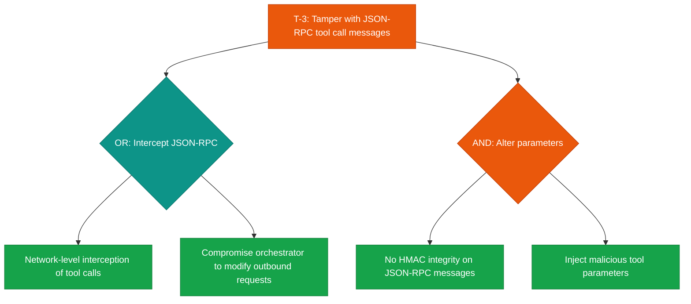

# Attack Tree: T-3 — JSON-RPC Message Tampering

```mermaid
flowchart TD
    T3_root["T-3: Tamper with JSON-RPC tool call messages"]
    T3_or1{"OR: Intercept JSON-RPC"}
    T3_leaf1["Network-level interception of tool calls"]
    T3_leaf2["Compromise orchestrator to modify outbound requests"]
    T3_and1{"AND: Alter parameters"}
    T3_leaf3["No HMAC integrity on JSON-RPC messages"]
    T3_leaf4["Inject malicious tool parameters"]

    T3_root --> T3_or1
    T3_root --> T3_and1
    T3_or1 --> T3_leaf1
    T3_or1 --> T3_leaf2
    T3_and1 --> T3_leaf3
    T3_and1 --> T3_leaf4

    classDef goal fill:#EA580C,color:#fff,stroke:#C2410C
    classDef andGate fill:#EA580C,color:#fff,stroke:#C2410C
    classDef orGate fill:#0D9488,color:#fff,stroke:#0F766E
    classDef leaf fill:#16A34A,color:#fff,stroke:#15803D
    class T3_root goal
    class T3_and1 andGate
    class T3_or1 orGate
    class T3_leaf1,T3_leaf2,T3_leaf3,T3_leaf4 leaf
```
