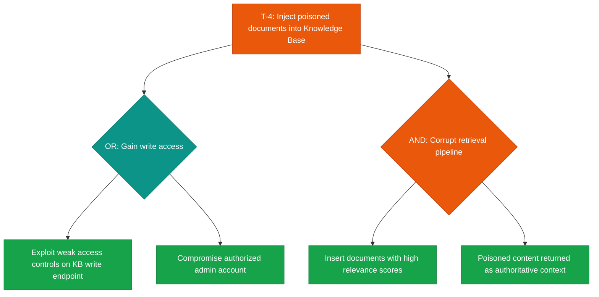

# Attack Tree: T-4 — Knowledge Base Document Injection

```mermaid
flowchart TD
    T4_root["T-4: Inject poisoned documents into Knowledge Base"]
    T4_or1{"OR: Gain write access"}
    T4_leaf1["Exploit weak access controls on KB write endpoint"]
    T4_leaf2["Compromise authorized admin account"]
    T4_and1{"AND: Corrupt retrieval pipeline"}
    T4_leaf3["Insert documents with high relevance scores"]
    T4_leaf4["Poisoned content returned as authoritative context"]

    T4_root --> T4_or1
    T4_root --> T4_and1
    T4_or1 --> T4_leaf1
    T4_or1 --> T4_leaf2
    T4_and1 --> T4_leaf3
    T4_and1 --> T4_leaf4

    classDef goal fill:#EA580C,color:#fff,stroke:#C2410C
    classDef andGate fill:#EA580C,color:#fff,stroke:#C2410C
    classDef orGate fill:#0D9488,color:#fff,stroke:#0F766E
    classDef leaf fill:#16A34A,color:#fff,stroke:#15803D
    class T4_root goal
    class T4_and1 andGate
    class T4_or1 orGate
    class T4_leaf1,T4_leaf2,T4_leaf3,T4_leaf4 leaf
```
