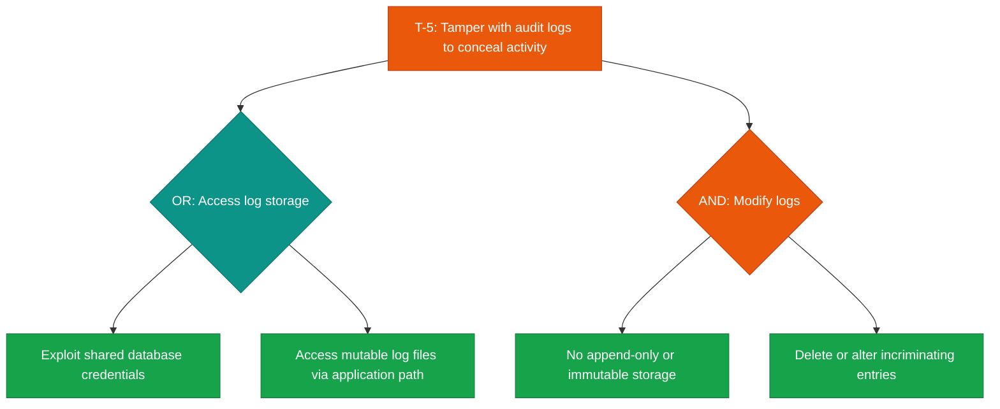

# Attack Tree: T-5 — Audit Log Tampering

```mermaid
flowchart TD
    T5_root["T-5: Tamper with audit logs to conceal activity"]
    T5_or1{"OR: Access log storage"}
    T5_leaf1["Exploit shared database credentials"]
    T5_leaf2["Access mutable log files via application path"]
    T5_and1{"AND: Modify logs"}
    T5_leaf3["No append-only or immutable storage"]
    T5_leaf4["Delete or alter incriminating entries"]

    T5_root --> T5_or1
    T5_root --> T5_and1
    T5_or1 --> T5_leaf1
    T5_or1 --> T5_leaf2
    T5_and1 --> T5_leaf3
    T5_and1 --> T5_leaf4

    classDef goal fill:#EA580C,color:#fff,stroke:#C2410C
    classDef andGate fill:#EA580C,color:#fff,stroke:#C2410C
    classDef orGate fill:#0D9488,color:#fff,stroke:#0F766E
    classDef leaf fill:#16A34A,color:#fff,stroke:#15803D
    class T5_root goal
    class T5_and1 andGate
    class T5_or1 orGate
    class T5_leaf1,T5_leaf2,T5_leaf3,T5_leaf4 leaf
```
