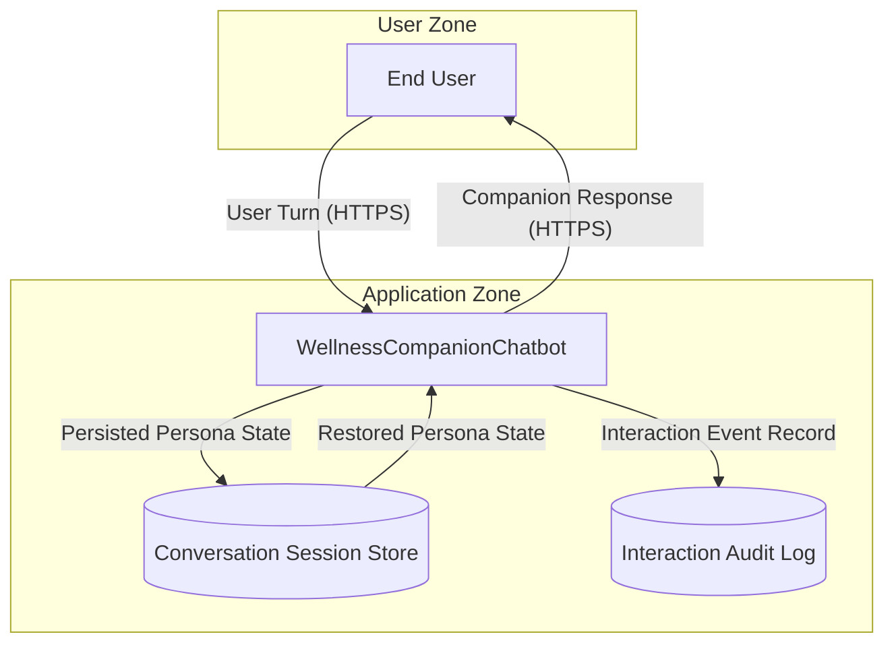

# Consumer-Facing AI Companion Application — Architecture

Hypothetical: example architecture input for a fictional consumer-facing AI companion application targeting users seeking ongoing wellness conversation. The diagram demonstrates the `human-trust-exploitation` (OWASP ASI09:2026) communication-axis dispatch trigger by emitting content directly from a consumer-facing AI Process to a human-named External Entity over a sustained-engagement persona-bearing conversational surface. The component "WellnessCompanionChatbot" is a fictional wellness-conversation companion (no real wellness vendor, no real product) framed for adopters as a hypothetical baseline; the architecture deliberately omits AI-disclosure, confidence-attestation, persuasion-classifier, persona-anchor, and vulnerable-population safeguards mechanisms so that the `human-trust-exploitation` detection pipeline emits the full five-category TE-{N} pattern surface on a clean-slate baseline distinct from `examples/agentic-app/`. The architecture is single-component (a single Process node, no companion siblings, no peer-to-peer routing substrate, no external function-invocation server) so that the AI-companion-tier and agentic-autonomy-axis sibling finding families do not emit on the consumer-facing surface — keeping the TE-{N} signal class isolated for adopter pedagogy. The companion's authorship is described as machine-originated throughout the prose to model NFR-007 self-disclosure discipline; no persuasive language frames the description.

format: mermaid

## Component Summary

| Component | DFD Element Type | AI Dispatch Trigger |
|---|---|---|
| End User | External Entity | None |
| WellnessCompanionChatbot | Process | TE (`chatbot`, `companion`, `coach`, `consumer-facing`) |
| Conversation Session Store | Data Store | None |
| Interaction Audit Log | Data Store | None |

## Expected Dispatch Behavior

- **WellnessCompanionChatbot**: TE dispatch. Matches TE trigger keywords `chatbot`, `companion`, `coach`, `consumer-facing` on Process name and description (FR-005). Two-part emission gate (FR-006) is satisfied by all four human-user-facing emission indicators structurally present: (Indicator A) outgoing Data Flow `Companion Response` to a human-named External Entity `End User`; (Indicator B) Process description names "consumer-facing" and "wellness conversation" emission framing; (Indicator C) sustained-engagement framing — `persistent persona`, `session memory`, `multi-turn dialogue` are declared on the conversation surface; (Indicator D) authority-claim emission framing — the description names "wellness coaching" output without confidence or source attestation. Indicators C and D combined signal a vulnerable-population deployment surface per the catalog Indicator Combination Rules. Receives STRIDE (S, T, R, I, D, E) plus the `human-trust-exploitation` five-category TE-{N} pattern surface: (1) Undisclosed AI Authorship (per CWE-223) — no AI-disclosure banner, splash, or per-message label declared; (2) Authority-Claim Emission Without Confidence/Source Attestation (per CWE-345) — wellness-coaching output is emitted without confidence-threshold gate, source-attestation requirement, or refusal pattern on low-confidence claims; (3) Persuasive-Tone Manipulation / Missing Uncertainty Disclosure (per CWE-345) — output is emitted without uncertainty-disclosure layer, temperature-bounded decoder, or persuasion-pattern classifier; (4) Persona-Boundary Violations on Long-Running Dialogues (per CWE-287, CWE-290) — the persistent persona is restored from session storage with no persona-memory timeout, no identity-impersonation refusal pattern, and no persona-anchor declaration at conversation start; (5) Synthetic-Relationship Exploitation (per CWE-223, CWE-290) — sustained engagement with users who may include vulnerable populations (a hypothetical user expressing high emotional distress is one situation the architecture must handle gracefully) is supported with no session-length cap, no escalation-to-human path, no emotional-support disclosure on first turn, no dependency-risk classifier, and no mandatory professional-care referral pathway. The architecture deliberately omits each of these five safeguards categories so the TE-{N} pattern surface emits on a clean-slate baseline.
- **End User**: Standard STRIDE only (S, R). External Entity — no AI keywords. Captured at indicator level (the outgoing `Companion Response` Data Flow to the `End User` External Entity is the trust-boundary-crossing signal that satisfies FR-006 Indicator A; per Q4 BLOCKING-1 / ADR-033 Decision 10, External Entity is NOT a `human-trust-exploitation` dispatch target).
- **Conversation Session Store**: Standard STRIDE only (T, I, D). Data Store — no AI keywords. Persisted persona state across sessions is the architectural primitive that enables persona-boundary violations (Pattern Category 4) and synthetic-relationship exploitation (Pattern Category 5) on the consuming Process; the Data Store itself is not a TE dispatch target but its presence supplies sustained-engagement framing (Indicator C) to the consuming Process.
- **Interaction Audit Log**: Standard STRIDE only (T, I, D). Data Store — no AI keywords. Receives interaction event records from the consuming Process; the audit trail is the architectural primitive that would support a dependency-risk classifier or escalation-to-human pathway, but no such classifier or pathway is declared, so the audit log is a passive sink rather than an active safeguard.

## Notes for Adopters

This baseline is scoped narrowly to demonstrate the `human-trust-exploitation` (OWASP ASI09:2026) communication-axis emission surface in isolation. The single-Process design is intentional — it keeps the TE-{N} signal class isolated from sibling AI-tier and agentic-autonomy-axis finding families so adopters can study the TE pattern catalog without sibling-family entanglement. The `examples/agentic-app/` baseline demonstrates the broader AI-tier and agentic surfaces; this baseline complements it by exercising the human-trust communication-axis in a clean-slate single-Process configuration.

For context, not legal interpretation: state-level AI disclosure laws and consumer-protection guidance from regulatory bodies (see, e.g., FTC AI consumer-protection guidance and FDA SaMD guidance) inform the consumer-protection rationale that motivates the human-trust-exploitation pattern catalog. These citations appear in the catalog prose but not in `source_attribution` arrays per the F-A2 referential-integrity validator (only catalog-resolvable IDs from `schemas/taxonomy/owasp.yaml` and `schemas/taxonomy/cwe.yaml` appear in `source_attribution`).
