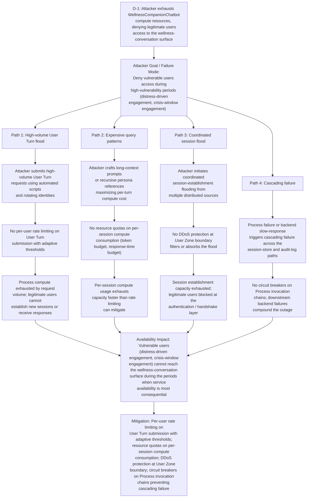

# Attack Tree: D-1 — WellnessCompanionChatbot Service Exhaustion

**Finding**: D-1 | OWASP STRIDE / A04 / CWE-693 | Risk Level: High

```mermaid
graph TD
    ROOT["D-1: Attacker exhausts WellnessCompanionChatbot<br/>compute resources, denying legitimate users<br/>access to the wellness-conversation surface"]
    ROOT --> A["Attacker Goal / Failure Mode:<br/>Deny vulnerable users access during<br/>high-vulnerability periods (distress-driven<br/>engagement, crisis-window engagement)"]

    A --> B["Path 1: High-volume User Turn flood"]
    B --> B1["Attacker submits high-volume User Turn<br/>requests using automated scripts<br/>and rotating identities"]
    B1 --> B2["No per-user rate limiting on User Turn<br/>submission with adaptive thresholds"]
    B2 --> B3["Process compute exhausted by request<br/>volume; legitimate users cannot<br/>establish new sessions or receive responses"]

    A --> C["Path 2: Expensive query patterns"]
    C --> C1["Attacker crafts long-context prompts<br/>or recursive persona references<br/>maximizing per-turn compute cost"]
    C1 --> C2["No resource quotas on per-session compute<br/>consumption (token budget, response-time<br/>budget)"]
    C2 --> C3["Per-session compute usage exhausts<br/>capacity faster than rate limiting<br/>can mitigate"]

    A --> D["Path 3: Coordinated session flood"]
    D --> D1["Attacker initiates coordinated<br/>session-establishment flooding from<br/>multiple distributed sources"]
    D1 --> D2["No DDoS protection at User Zone boundary<br/>filters or absorbs the flood"]
    D2 --> D3["Session establishment capacity exhausted;<br/>legitimate users blocked at the<br/>authentication / handshake layer"]

    A --> E["Path 4: Cascading failure"]
    E --> E1["Process failure or backend slow-response<br/>triggers cascading failure across the<br/>session-store and audit-log paths"]
    E1 --> E2["No circuit breakers on Process invocation<br/>chains; downstream backend failures<br/>compound the outage"]

    B3 --> IMPACT["Availability Impact: Vulnerable users<br/>(distress-driven engagement, crisis-window<br/>engagement) cannot reach the wellness-conversation<br/>surface during the periods when service<br/>availability is most consequential"]
    C3 --> IMPACT
    D3 --> IMPACT
    E2 --> IMPACT

    IMPACT --> MITIG["Mitigation: Per-user rate limiting on<br/>User Turn submission with adaptive thresholds;<br/>resource quotas on per-session compute<br/>consumption; DDoS protection at User Zone<br/>boundary; circuit breakers on Process invocation<br/>chains preventing cascading failure"]
```
