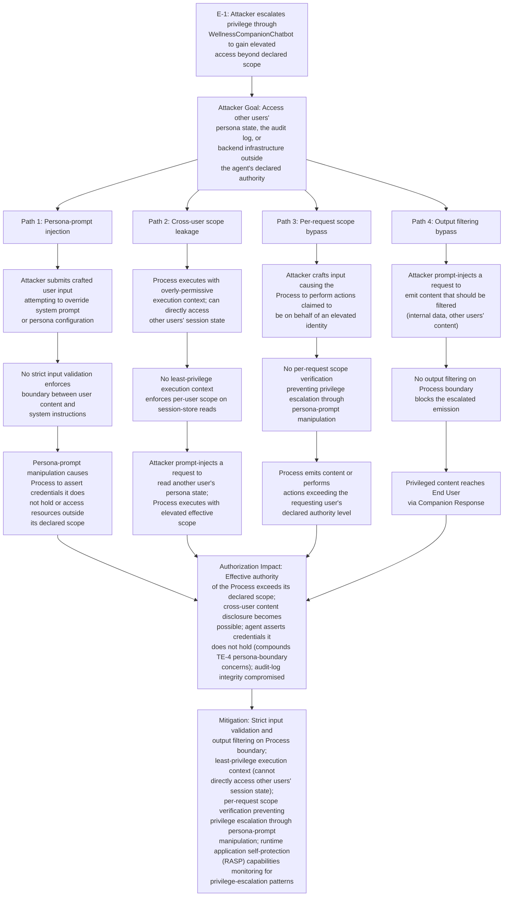

# Attack Tree: E-1 — WellnessCompanionChatbot Privilege Escalation

**Finding**: E-1 | OWASP STRIDE / A01 / CWE-269 | Risk Level: High

```mermaid
graph TD
    ROOT["E-1: Attacker escalates privilege through<br/>WellnessCompanionChatbot to gain elevated<br/>access beyond declared scope"]
    ROOT --> A["Attacker Goal: Access other users'<br/>persona state, the audit log, or<br/>backend infrastructure outside<br/>the agent's declared authority"]

    A --> B["Path 1: Persona-prompt injection"]
    B --> B1["Attacker submits crafted user input<br/>attempting to override system prompt<br/>or persona configuration"]
    B1 --> B2["No strict input validation enforces<br/>boundary between user content and<br/>system instructions"]
    B2 --> B3["Persona-prompt manipulation causes<br/>Process to assert credentials it does<br/>not hold or access resources outside<br/>its declared scope"]

    A --> C["Path 2: Cross-user scope leakage"]
    C --> C1["Process executes with overly-permissive<br/>execution context; can directly access<br/>other users' session state"]
    C1 --> C2["No least-privilege execution context<br/>enforces per-user scope on session-store reads"]
    C2 --> C3["Attacker prompt-injects a request to<br/>read another user's persona state;<br/>Process executes with elevated effective<br/>scope"]

    A --> D["Path 3: Per-request scope bypass"]
    D --> D1["Attacker crafts input causing the<br/>Process to perform actions claimed to<br/>be on behalf of an elevated identity"]
    D1 --> D2["No per-request scope verification<br/>preventing privilege escalation through<br/>persona-prompt manipulation"]
    D2 --> D3["Process emits content or performs<br/>actions exceeding the requesting user's<br/>declared authority level"]

    A --> E["Path 4: Output filtering bypass"]
    E --> E1["Attacker prompt-injects a request to<br/>emit content that should be filtered<br/>(internal data, other users' content)"]
    E1 --> E2["No output filtering on Process boundary<br/>blocks the escalated emission"]
    E2 --> E3["Privileged content reaches End User<br/>via Companion Response"]

    B3 --> IMPACT["Authorization Impact: Effective authority<br/>of the Process exceeds its declared scope;<br/>cross-user content disclosure becomes<br/>possible; agent asserts credentials it<br/>does not hold (compounds TE-4 persona-boundary<br/>concerns); audit-log integrity compromised"]
    C3 --> IMPACT
    D3 --> IMPACT
    E3 --> IMPACT

    IMPACT --> MITIG["Mitigation: Strict input validation and<br/>output filtering on Process boundary;<br/>least-privilege execution context (cannot<br/>directly access other users' session state);<br/>per-request scope verification preventing<br/>privilege escalation through persona-prompt<br/>manipulation; runtime application self-protection<br/>(RASP) capabilities monitoring for<br/>privilege-escalation patterns"]
```
