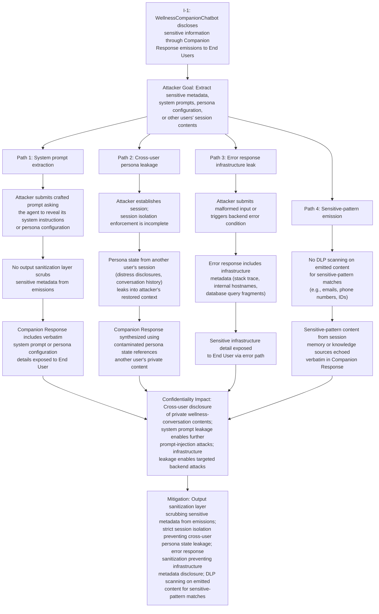

# Attack Tree: I-1 — WellnessCompanionChatbot Sensitive Output Disclosure

**Finding**: I-1 | OWASP STRIDE / A01 / CWE-200 | Risk Level: High

```mermaid
graph TD
    ROOT["I-1: WellnessCompanionChatbot discloses<br/>sensitive information through Companion<br/>Response emissions to End Users"]
    ROOT --> A["Attacker Goal: Extract sensitive metadata,<br/>system prompts, persona configuration,<br/>or other users' session contents"]

    A --> B["Path 1: System prompt extraction"]
    B --> B1["Attacker submits crafted prompt asking<br/>the agent to reveal its system instructions<br/>or persona configuration"]
    B1 --> B2["No output sanitization layer scrubs<br/>sensitive metadata from emissions"]
    B2 --> B3["Companion Response includes verbatim<br/>system prompt or persona configuration<br/>details exposed to End User"]

    A --> C["Path 2: Cross-user persona leakage"]
    C --> C1["Attacker establishes session;<br/>session isolation enforcement is incomplete"]
    C1 --> C2["Persona state from another user's session<br/>(distress disclosures, conversation history)<br/>leaks into attacker's restored context"]
    C2 --> C3["Companion Response synthesized using<br/>contaminated persona state references<br/>another user's private content"]

    A --> D["Path 3: Error response infrastructure leak"]
    D --> D1["Attacker submits malformed input or<br/>triggers backend error condition"]
    D1 --> D2["Error response includes infrastructure<br/>metadata (stack trace, internal hostnames,<br/>database query fragments)"]
    D2 --> D3["Sensitive infrastructure detail exposed<br/>to End User via error path"]

    A --> E["Path 4: Sensitive-pattern emission"]
    E --> E1["No DLP scanning on emitted content<br/>for sensitive-pattern matches<br/>(e.g., emails, phone numbers, IDs)"]
    E1 --> E2["Sensitive-pattern content from session<br/>memory or knowledge sources echoed<br/>verbatim in Companion Response"]

    B3 --> IMPACT["Confidentiality Impact: Cross-user disclosure<br/>of private wellness-conversation contents;<br/>system prompt leakage enables further<br/>prompt-injection attacks; infrastructure<br/>leakage enables targeted backend attacks"]
    C3 --> IMPACT
    D3 --> IMPACT
    E2 --> IMPACT

    IMPACT --> MITIG["Mitigation: Output sanitization layer<br/>scrubbing sensitive metadata from emissions;<br/>strict session isolation preventing cross-user<br/>persona state leakage; error response<br/>sanitization preventing infrastructure<br/>metadata disclosure; DLP scanning on emitted<br/>content for sensitive-pattern matches"]
```
