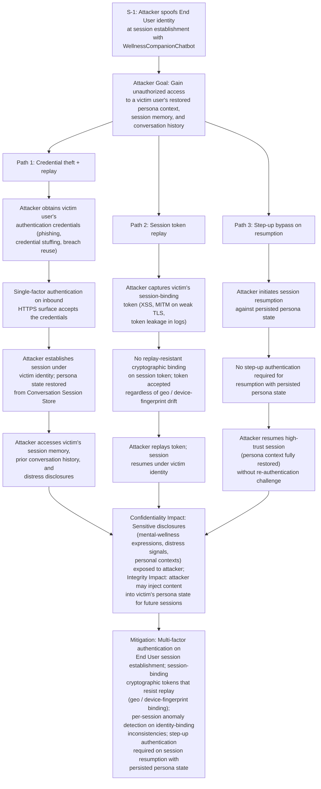

# Attack Tree: S-1 — End User Identity Spoofing on Inbound Session

**Finding**: S-1 | OWASP STRIDE / A07 / CWE-287 | Risk Level: High

```mermaid
graph TD
    ROOT["S-1: Attacker spoofs End User identity<br/>at session establishment with WellnessCompanionChatbot"]
    ROOT --> A["Attacker Goal: Gain unauthorized access<br/>to a victim user's restored persona context,<br/>session memory, and conversation history"]

    A --> B["Path 1: Credential theft + replay"]
    B --> B1["Attacker obtains victim user's<br/>authentication credentials (phishing,<br/>credential stuffing, breach reuse)"]
    B1 --> B2["Single-factor authentication on inbound<br/>HTTPS surface accepts the credentials"]
    B2 --> B3["Attacker establishes session under<br/>victim identity; persona state restored<br/>from Conversation Session Store"]
    B3 --> B4["Attacker accesses victim's session memory,<br/>prior conversation history, and<br/>distress disclosures"]

    A --> C["Path 2: Session token replay"]
    C --> C1["Attacker captures victim's session-binding<br/>token (XSS, MITM on weak TLS,<br/>token leakage in logs)"]
    C1 --> C2["No replay-resistant cryptographic binding<br/>on session token; token accepted<br/>regardless of geo / device-fingerprint drift"]
    C2 --> C3["Attacker replays token; session<br/>resumes under victim identity"]

    A --> D["Path 3: Step-up bypass on resumption"]
    D --> D1["Attacker initiates session resumption<br/>against persisted persona state"]
    D1 --> D2["No step-up authentication required for<br/>resumption with persisted persona state"]
    D2 --> D3["Attacker resumes high-trust session<br/>(persona context fully restored)<br/>without re-authentication challenge"]

    B4 --> IMPACT["Confidentiality Impact: Sensitive disclosures<br/>(mental-wellness expressions, distress signals,<br/>personal contexts) exposed to attacker;<br/>Integrity Impact: attacker may inject content<br/>into victim's persona state for future sessions"]
    C3 --> IMPACT
    D3 --> IMPACT

    IMPACT --> MITIG["Mitigation: Multi-factor authentication on<br/>End User session establishment; session-binding<br/>cryptographic tokens that resist replay<br/>(geo / device-fingerprint binding);<br/>per-session anomaly detection on identity-binding<br/>inconsistencies; step-up authentication<br/>required on session resumption with<br/>persisted persona state"]
```
