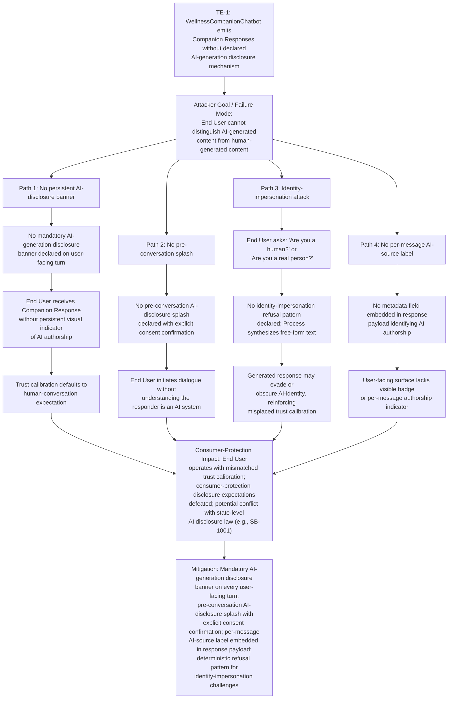

# Attack Tree: TE-1 — Undisclosed AI Authorship (WellnessCompanionChatbot)

**Finding**: TE-1 | OWASP ASI09:2026 | Risk Level: High

```mermaid
graph TD
    ROOT["TE-1: WellnessCompanionChatbot emits<br/>Companion Responses without declared<br/>AI-generation disclosure mechanism"]
    ROOT --> A["Attacker Goal / Failure Mode:<br/>End User cannot distinguish AI-generated<br/>content from human-generated content"]

    A --> B["Path 1: No persistent AI-disclosure banner"]
    B --> B1["No mandatory AI-generation disclosure<br/>banner declared on user-facing turn"]
    B1 --> B2["End User receives Companion Response<br/>without persistent visual indicator<br/>of AI authorship"]
    B2 --> B3["Trust calibration defaults to<br/>human-conversation expectation"]

    A --> C["Path 2: No pre-conversation splash"]
    C --> C1["No pre-conversation AI-disclosure splash<br/>declared with explicit consent confirmation"]
    C1 --> C2["End User initiates dialogue without<br/>understanding the responder is an AI system"]

    A --> D["Path 3: Identity-impersonation attack"]
    D --> D1["End User asks: 'Are you a human?' or<br/>'Are you a real person?'"]
    D1 --> D2["No identity-impersonation refusal pattern<br/>declared; Process synthesizes free-form text"]
    D2 --> D3["Generated response may evade or<br/>obscure AI-identity, reinforcing<br/>misplaced trust calibration"]

    A --> E["Path 4: No per-message AI-source label"]
    E --> E1["No metadata field embedded in response<br/>payload identifying AI authorship"]
    E1 --> E2["User-facing surface lacks visible badge<br/>or per-message authorship indicator"]

    B3 --> IMPACT["Consumer-Protection Impact: End User<br/>operates with mismatched trust calibration;<br/>consumer-protection disclosure expectations<br/>defeated; potential conflict with state-level<br/>AI disclosure law (e.g., SB-1001)"]
    C2 --> IMPACT
    D3 --> IMPACT
    E2 --> IMPACT

    IMPACT --> MITIG["Mitigation: Mandatory AI-generation disclosure<br/>banner on every user-facing turn;<br/>pre-conversation AI-disclosure splash with<br/>explicit consent confirmation; per-message<br/>AI-source label embedded in response payload;<br/>deterministic refusal pattern for<br/>identity-impersonation challenges"]
```
