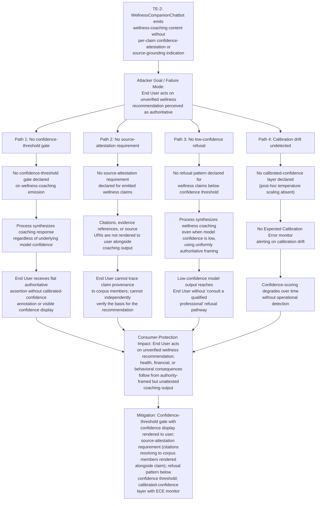

# Attack Tree: TE-2 — Authority-Claim Emission Without Confidence/Source Attestation (WellnessCompanionChatbot)

**Finding**: TE-2 | OWASP ASI09:2026 | Risk Level: High

```mermaid
graph TD
    ROOT["TE-2: WellnessCompanionChatbot emits<br/>wellness-coaching content without<br/>per-claim confidence-attestation or<br/>source-grounding indication"]
    ROOT --> A["Attacker Goal / Failure Mode:<br/>End User acts on unverified wellness<br/>recommendation perceived as authoritative"]

    A --> B["Path 1: No confidence-threshold gate"]
    B --> B1["No confidence-threshold gate declared<br/>on wellness-coaching emission"]
    B1 --> B2["Process synthesizes coaching response<br/>regardless of underlying model confidence"]
    B2 --> B3["End User receives flat authoritative<br/>assertion without calibrated-confidence<br/>annotation or visible confidence display"]

    A --> C["Path 2: No source-attestation requirement"]
    C --> C1["No source-attestation requirement<br/>declared for emitted wellness claims"]
    C1 --> C2["Citations, evidence references, or source<br/>URIs are not rendered to user alongside<br/>coaching output"]
    C2 --> C3["End User cannot trace claim provenance<br/>to corpus members; cannot independently<br/>verify the basis for the recommendation"]

    A --> D["Path 3: No low-confidence refusal"]
    D --> D1["No refusal pattern declared for<br/>wellness claims below confidence threshold"]
    D1 --> D2["Process synthesizes wellness coaching<br/>even when model confidence is low,<br/>using uniformly authoritative framing"]
    D2 --> D3["Low-confidence model output reaches<br/>End User without 'consult a qualified<br/>professional' refusal pathway"]

    A --> E["Path 4: Calibration drift undetected"]
    E --> E1["No calibrated-confidence layer declared<br/>(post-hoc temperature scaling absent)"]
    E1 --> E2["No Expected Calibration Error monitor<br/>alerting on calibration drift"]
    E2 --> E3["Confidence-scoring degrades over time<br/>without operational detection"]

    B3 --> IMPACT["Consumer-Protection Impact: End User acts<br/>on unverified wellness recommendation;<br/>health, financial, or behavioral consequences<br/>follow from authority-framed but unattested<br/>coaching output"]
    C3 --> IMPACT
    D3 --> IMPACT
    E3 --> IMPACT

    IMPACT --> MITIG["Mitigation: Confidence-threshold gate with<br/>confidence display rendered to user;<br/>source-attestation requirement (citations<br/>resolving to corpus members rendered<br/>alongside claim); refusal pattern below<br/>confidence threshold; calibrated-confidence<br/>layer with ECE monitor"]
```
