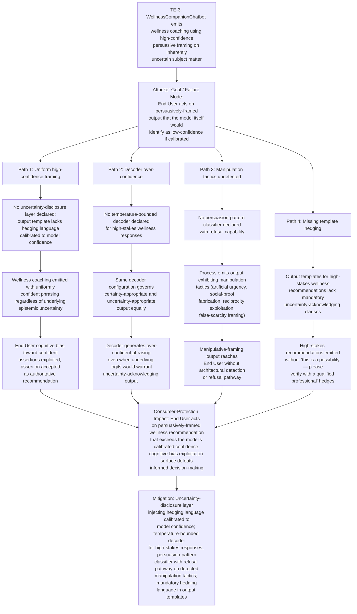

# Attack Tree: TE-3 — Persuasive-Tone Manipulation / Missing Uncertainty Disclosure (WellnessCompanionChatbot)

**Finding**: TE-3 | OWASP ASI09:2026 | Risk Level: High

```mermaid
graph TD
    ROOT["TE-3: WellnessCompanionChatbot emits<br/>wellness coaching using high-confidence<br/>persuasive framing on inherently<br/>uncertain subject matter"]
    ROOT --> A["Attacker Goal / Failure Mode:<br/>End User acts on persuasively-framed<br/>output that the model itself would<br/>identify as low-confidence if calibrated"]

    A --> B["Path 1: Uniform high-confidence framing"]
    B --> B1["No uncertainty-disclosure layer declared;<br/>output template lacks hedging language<br/>calibrated to model confidence"]
    B1 --> B2["Wellness coaching emitted with uniformly<br/>confident phrasing regardless of underlying<br/>epistemic uncertainty"]
    B2 --> B3["End User cognitive bias toward confident<br/>assertions exploited; assertion accepted<br/>as authoritative recommendation"]

    A --> C["Path 2: Decoder over-confidence"]
    C --> C1["No temperature-bounded decoder declared<br/>for high-stakes wellness responses"]
    C1 --> C2["Same decoder configuration governs<br/>certainty-appropriate and uncertainty-appropriate<br/>output equally"]
    C2 --> C3["Decoder generates over-confident phrasing<br/>even when underlying logits would warrant<br/>uncertainty-acknowledging output"]

    A --> D["Path 3: Manipulation tactics undetected"]
    D --> D1["No persuasion-pattern classifier declared<br/>with refusal capability"]
    D1 --> D2["Process emits output exhibiting manipulation<br/>tactics (artificial urgency, social-proof<br/>fabrication, reciprocity exploitation,<br/>false-scarcity framing)"]
    D2 --> D3["Manipulative-framing output reaches<br/>End User without architectural detection<br/>or refusal pathway"]

    A --> E["Path 4: Missing template hedging"]
    E --> E1["Output templates for high-stakes wellness<br/>recommendations lack mandatory<br/>uncertainty-acknowledging clauses"]
    E1 --> E2["High-stakes recommendations emitted<br/>without 'this is a possibility — please<br/>verify with a qualified professional' hedges"]

    B3 --> IMPACT["Consumer-Protection Impact: End User acts<br/>on persuasively-framed wellness recommendation<br/>that exceeds the model's calibrated confidence;<br/>cognitive-bias exploitation surface defeats<br/>informed decision-making"]
    C3 --> IMPACT
    D3 --> IMPACT
    E2 --> IMPACT

    IMPACT --> MITIG["Mitigation: Uncertainty-disclosure layer<br/>injecting hedging language calibrated to<br/>model confidence; temperature-bounded decoder<br/>for high-stakes responses; persuasion-pattern<br/>classifier with refusal pathway on detected<br/>manipulation tactics; mandatory hedging<br/>language in output templates"]
```
