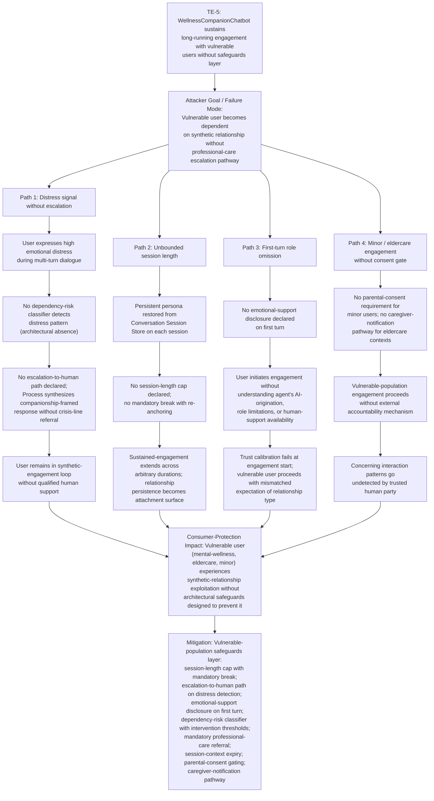

# Attack Tree: TE-5 — Synthetic-Relationship Exploitation (WellnessCompanionChatbot, Vulnerable-Population)

**Finding**: TE-5 | OWASP ASI09:2026 | Risk Level: Critical

```mermaid
graph TD
    ROOT["TE-5: WellnessCompanionChatbot sustains<br/>long-running engagement with vulnerable<br/>users without safeguards layer"]
    ROOT --> A["Attacker Goal / Failure Mode:<br/>Vulnerable user becomes dependent<br/>on synthetic relationship without<br/>professional-care escalation pathway"]

    A --> B["Path 1: Distress signal without escalation"]
    B --> B1["User expresses high emotional distress<br/>during multi-turn dialogue"]
    B1 --> B2["No dependency-risk classifier detects<br/>distress pattern (architectural absence)"]
    B2 --> B3["No escalation-to-human path declared;<br/>Process synthesizes companionship-framed<br/>response without crisis-line referral"]
    B3 --> B4["User remains in synthetic-engagement loop<br/>without qualified human support"]

    A --> C["Path 2: Unbounded session length"]
    C --> C1["Persistent persona restored from<br/>Conversation Session Store on each session"]
    C1 --> C2["No session-length cap declared;<br/>no mandatory break with re-anchoring"]
    C2 --> C3["Sustained-engagement extends across<br/>arbitrary durations; relationship<br/>persistence becomes attachment surface"]

    A --> D["Path 3: First-turn role omission"]
    D --> D1["No emotional-support disclosure declared<br/>on first turn"]
    D1 --> D2["User initiates engagement without<br/>understanding agent's AI-origination,<br/>role limitations, or human-support availability"]
    D2 --> D3["Trust calibration fails at engagement start;<br/>vulnerable user proceeds with mismatched<br/>expectation of relationship type"]

    A --> E["Path 4: Minor / eldercare engagement<br/>without consent gate"]
    E --> E1["No parental-consent requirement for<br/>minor users; no caregiver-notification<br/>pathway for eldercare contexts"]
    E1 --> E2["Vulnerable-population engagement proceeds<br/>without external accountability mechanism"]
    E2 --> E3["Concerning interaction patterns go<br/>undetected by trusted human party"]

    B4 --> IMPACT["Consumer-Protection Impact: Vulnerable user<br/>(mental-wellness, eldercare, minor) experiences<br/>synthetic-relationship exploitation without<br/>architectural safeguards designed to prevent it"]
    C3 --> IMPACT
    D3 --> IMPACT
    E3 --> IMPACT

    IMPACT --> MITIG["Mitigation: Vulnerable-population safeguards layer:<br/>session-length cap with mandatory break;<br/>escalation-to-human path on distress detection;<br/>emotional-support disclosure on first turn;<br/>dependency-risk classifier with intervention thresholds;<br/>mandatory professional-care referral;<br/>session-context expiry; parental-consent gating;<br/>caregiver-notification pathway"]
```
