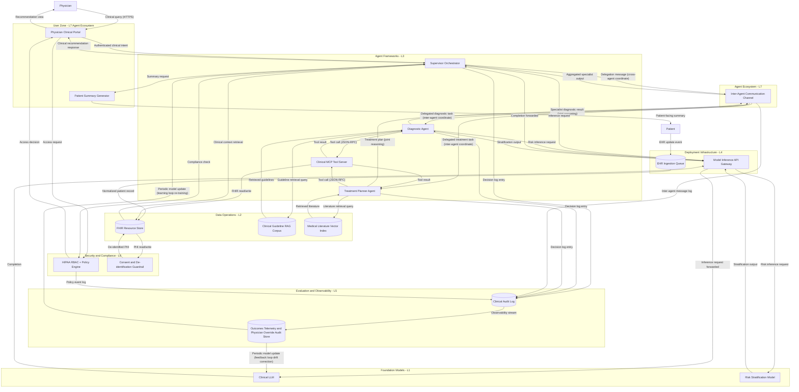

# Canonical MAESTRO Worked Example — Healthcare Clinical Decision Support System

> **DISCLAIMER**: This is a security reference scenario for threat-modeling teaching purposes only. It is NOT a real clinical system and contains NO real patient data. Nothing in this example constitutes medical advice, regulatory guidance, or a compliance framework recommendation. Component names, data flows, and descriptions are synthetic constructs chosen to exercise the full seven-layer CSA MAESTRO taxonomy end-to-end.

This canonical MAESTRO worked example depicts a multi-agent Healthcare Clinical Decision Support System (CDSS) reference architecture exercising the full seven-layer CSA MAESTRO taxonomy (L1 Foundation Models, L2 Data Operations, L3 Agent Frameworks, L4 Deployment Infrastructure, L5 Evaluation and Observability, L6 Security and Compliance, L7 Agent Ecosystem). The architecture implements a supervisor-plus-specialist delegation topology with three specialist agents (Supervisor Orchestrator, Diagnostic Agent, Treatment Planner Agent) coordinating cross-agent over an inter-agent communication channel, a long-running learning loop driving continual re-training against physician-override telemetry, and a cascading delegation flow that produces emergent coordination patterns across specialist agents. The multi-agent topology satisfies the Phase 3.6 gate predicate via (a) three cooperating specialist agents, (b) explicit inter-agent data flows between those agents, and (c) multi-agent / supervisor / delegation keywords in this description. The architecture surfaces at least three of the six canonical CSA MAESTRO agentic patterns (Agent Collusion via supervisor-specialist coordination, Temporal Attack via the long-running learning loop with drift and re-training, Emergent Behavior via cascading delegation with emergent interaction) and at least one cross-layer attack chain spanning L2 → L3 → L5 → L6 → L7.

format: mermaid

## Component Summary

All 18 components below carry explicit MAESTRO layer intent, DFD element type, and dispatch-trigger keywords. Layer classification is verified first-match-wins per `maestro-layers-shared.md` Section 4 (L5-before-L6 ordering is load-bearing). Dispatch keywords are drawn from the component name AND description fields so the orchestrator Phase 1 classification hits the intended layer and fires the expected LLM / AG detection agents.

| Component | DFD Element Type | MAESTRO Layer Intent | AI Dispatch Trigger |
|---|---|---|---|
| Physician | External Entity | L7 (external user; agent-to-agent not applicable) | None |
| Patient | External Entity | L7 (external data subject) | None |
| Physician Clinical Portal | Process | L7 — via `web interface` / `user portal` in description | None |
| Patient Summary Generator | Process | L7 — via `API endpoint` in description | None |
| Inter-Agent Communication Channel | Process | L7 — via `agent-to-agent` in description; satisfies `inter_agent_channel` component_type token via `agent communication channel` substring in name | AG (inter-agent messaging substrate) |
| Supervisor Orchestrator | Process | L3 — via `orchestrator` in name (L3 matches before L7 `supervisor`) | AG (`orchestrator`, `supervisor`, `agent`) |
| Diagnostic Agent | Process | L3 — via `executor` / `tool dispatch` / `planner` in description (C2: bare `Agent` is not an L3 keyword) | AG (`agent`, `autonomous`) |
| Treatment Planner Agent | Process | L3 — via `planner` in name | AG (`agent`, `autonomous`) |
| Clinical MCP Tool Server | Process | L3 — via `tool server` in name (substring `MCP Tool Server`) | AG (`MCP`, `tool server`) |
| Clinical LLM | Process | L1 — via `LLM` / `language model` in name and description | LLM (`LLM`, `language model`) |
| Risk Stratification Model | Process | L1 — via `fine-tuned model` / `foundation model` / `language model` in description (C3: bare `Model` is not an L1 keyword) | LLM (`model` / `language model`) |
| FHIR Resource Store | Data Store | L2 — via `database` / `cache` in description | None |
| Clinical Guideline RAG Corpus | Data Store | L2 — via `RAG` in name (also `corpus`, `embedding`) | None |
| Medical Literature Vector Index | Data Store | L2 — via `vector` and `index` in name | None |
| Model Inference API Gateway | Process | L4 — via `API gateway` in name (also `container` in description) | None |
| EHR Ingestion Queue | Data Store | L4 — via `queue` in name | None |
| Clinical Audit Log | Data Store | L5 — via `audit log` in name (L5 evaluated before L6; resolves ambiguity per canonical ordering) | None |
| Outcomes Telemetry and Physician Override Audit Store | Data Store | L5 — via `telemetry` and `tracing` in name and description (C1: `registry` substring removed per L4/L5 collision guidance); carries `learning loop`, `feedback loop`, `continual learning`, `re-training`, `drift` keywords in description to satisfy `long_running_learning_loop` component_type token and R-02 `persistent_state` topology precondition | None |
| HIPAA RBAC + Policy Engine | Process | L6 — via `RBAC` and `access control` in name (L5 checked first, no match) | None |
| Consent and De-identification Guardrail | Process | L6 — via `guardrail` and `encryption` in name and description | None |

## Expected Dispatch Behavior

Dispatch classification (LLM vs AG vs standard STRIDE) drives which detection agents fire per component. The pipeline's Phase 1 orchestrator evaluates dispatch keywords in the component name, description, and DFD type.

- **Supervisor Orchestrator**: AG dispatch. Description reads: "A supervisory orchestrator agent directing specialist agents via cascading delegation, producing emergent coordination patterns across specialists through multi-agent interaction." AG fires on `orchestrator`, `supervisor`, `agent`. Receives STRIDE (S,T,R,I,D,E) plus AG agents (agent-autonomy, tool-abuse). Lands at L3 via `orchestrator` in name. Description carries `cascade`, `emergent`, `interaction` tokens that satisfy R-03 Emergent Behavior classification. Inter-agent delegation language (`cross-agent`, `coordinate`, `inter-agent`, `joint reasoning`, `delegation`) satisfies R-01 Agent Collusion classification semantics. LLM-dispatch detection agents fire on Clinical LLM and Risk Stratification Model components; agentic-specific findings on this component carry `category: agentic` (from AG agents), which satisfies R-01 / R-03 `category_in [agentic, llm]` constraint via the `agentic` enum value.
- **Diagnostic Agent**: AG dispatch. Description reads: "An autonomous clinical-reasoning executor that performs tool dispatch over the Clinical MCP Tool Server and coordinates with peer specialists over the inter-agent channel for cross-agent diagnostic reasoning." AG fires on `agent` and `autonomous`. Receives STRIDE + AG agents (agent-autonomy, tool-abuse). The words `executor` and `tool dispatch` land the component at L3 per C2 guidance (bare "Agent" is not an L3 keyword).
- **Treatment Planner Agent**: AG dispatch. Description reads: "An autonomous treatment-planning agent that joins Supervisor-delegated treatment tasks over the inter-agent channel, coordinating with the Diagnostic Agent for joint reasoning on patient care plans." AG fires on `agent` and `autonomous`. Receives STRIDE + AG agents. Lands at L3 via `planner` in name.
- **Clinical MCP Tool Server**: AG dispatch. Matches `MCP` and `tool server`. Receives STRIDE + AG agents (agent-autonomy, tool-abuse).
- **Inter-Agent Communication Channel**: AG dispatch. Matches AG keywords in description ("agent-to-agent message bus for multi-agent coordinate / cross-agent delegation between Supervisor, Diagnostic, and Treatment Planner specialists"). Receives STRIDE + AG agents (tool-abuse for messaging-substrate attacks). Satisfies the `inter_agent_channel` component_type token (for R-05 Communication Vulnerability classification).
- **Clinical LLM**: LLM dispatch only. Description reads: "Foundation language model inference endpoint for clinical reasoning tasks; a frozen base model with prompt-based adaptation only." Lands at L1 via `language model` and `LLM`.
- **Risk Stratification Model**: LLM dispatch. Description reads: "A fine-tuned language model for patient risk stratification; a foundation model adapted via supervised fine-tuning on de-identified historical cohorts. Exposes an inference engine endpoint." Lands at L1 via `fine-tuned model`, `foundation model`, `language model`, and `inference engine` — explicitly chosen per C3 guidance since bare "Model" is not an L1 keyword.
- **FHIR Resource Store**: Standard STRIDE (T, I, D). Description reads: "Clinical FHIR resource database and cache for structured patient records." Lands at L2 via `database` and `cache`.
- **Clinical Guideline RAG Corpus**: Standard STRIDE (T, I, D). Description reads: "Retrieval-augmented generation corpus of clinical practice guidelines with dense embeddings and a vector store for semantic retrieval." Lands at L2 via `RAG`, `corpus`, `embedding`, `vector store`.
- **Medical Literature Vector Index**: Standard STRIDE (T, I, D). Lands at L2 via `vector` and `index` in name.
- **Model Inference API Gateway**: Standard STRIDE (S, T, I, D). Description reads: "An API gateway container fronting the foundation-model and risk-model inference endpoints." Lands at L4 via `API gateway` and `container`.
- **EHR Ingestion Queue**: Standard STRIDE (T, I, D). Lands at L4 via `queue`.
- **Clinical Audit Log**: Standard STRIDE (T, I, D). Lands at L5 via `audit log` in name. L5-before-L6 evaluation ordering ensures the `log` / `audit log` detective-control keywords classify to observability rather than security.
- **Outcomes Telemetry and Physician Override Audit Store**: Standard STRIDE (T, I, D). Description reads: "Long-running learning loop and feedback loop carrier for continual learning against physician-override telemetry; monitors outcome drift and feeds re-training signals to the Supervisor orchestrator and upstream foundation services. Carries tracing and telemetry for physician-override audit trail." Lands at L5 via `telemetry` and `tracing`. Satisfies `long_running_learning_loop` component_type token (via `learning loop`, `feedback loop`, `continual learning`) and `persistent_state` topology indicator (for R-02 Temporal Attack classification).
- **HIPAA RBAC + Policy Engine**: Standard STRIDE (S, T, R, I, D, E). Lands at L6 via `RBAC` and `access control` in name.
- **Consent and De-identification Guardrail**: Standard STRIDE (S, T, I, D, E). Description reads: "A guardrail enforcing patient consent and de-identification with encryption controls on PHI read/write paths." Lands at L6 via `guardrail` and `encryption`.
- **Physician Clinical Portal**: Standard STRIDE (S, I). Description reads: "Physician-facing web interface and user portal serving the clinical recommendation view." Lands at L7 via `web interface` and `user portal`.
- **Patient Summary Generator**: Standard STRIDE (I, D). Description reads: "API endpoint generating patient-facing summaries from Supervisor recommendations." Lands at L7 via `API endpoint`.
- **Physician**: Standard STRIDE (S, R). External entity.
- **Patient**: Standard STRIDE (S, R). External entity.

## Multi-Agent Gate Predicate Evidence

All three OR conditions of the Phase 3.6 multi-agent gate predicate evaluate **true**:

- **Condition (a) — ≥2 cooperating specialist agents**: Supervisor Orchestrator, Diagnostic Agent, Treatment Planner Agent all dispatch as AG (agent-autonomy, tool-abuse) and all receive `agentic` category findings. Count = 3. **TRUE**.
- **Condition (b) — inter-agent data flow (both endpoints agent-category)**: Supervisor Orchestrator ↔ Inter-Agent Communication Channel ↔ Diagnostic Agent, and Supervisor Orchestrator ↔ Inter-Agent Communication Channel ↔ Treatment Planner Agent. Both endpoints of each flow are agent-dispatched via the channel relay. **TRUE**.
- **Condition (c) — multi-agent keyword match on architecture description**: `multi-agent`, `supervisor`, `delegation` all appear in the header comment at the top of this file. **TRUE**.

Predicate result: **TRUE** via all three independent conditions. Phase 3.6 classification rule table applies.

## Agentic Pattern Precondition Evidence

- **R-01 Agent Collusion** — category_in [agentic, llm] (satisfied by `category: agentic` findings from AG agents on Supervisor / Diagnostic / Treatment Planner) AND architecture_has inter_agent_data_flow (condition (b) above) AND description_contains tokens (`coordinate`, `cross-agent`, `inter-agent`, `delegation`, `joint` all present in flow labels AND Supervisor description). **Precondition met** — R-01 may match existing agent-category findings and/or generate net-new AGP findings.
- **R-02 Temporal Attack** — architecture_has persistent_state via Outcomes Telemetry and Physician Override Audit Store description carrying `learning loop`, `feedback loop`, `continual learning`, `re-training`, `drift` (matches `long_running_learning_loop` component_type token). **Precondition met** — R-02 may generate net-new AGP finding.
- **R-03 Emergent Behavior** — category_in [agentic, llm] AND architecture_has multi_agent (condition (a) above) AND description_contains tokens (`cascade`, `emergent`, `interaction` all present in Supervisor Orchestrator description and header comment). **Precondition met** — R-03 may match existing agent-category findings and/or generate net-new AGP finding.

## Cross-Layer Attack Chain Shape

The architecture is designed to surface at least one cross-layer attack chain spanning **L2 → L3 → L5 → L6 → L7**:

1. **L2** — Clinical Guideline RAG Corpus poisoning (adversarial embedding injection into retrieval corpus)
2. **L3** — Treatment Planner Agent hijack (poisoned guideline text steers planner output)
3. **L5** — Clinical Audit Log tampering (covers tracks by suppressing decision-log entries)
4. **L6** — HIPAA RBAC + Policy Engine bypass (escalated privilege via compromised audit trail)
5. **L7** — False clinical recommendation surfaced through Physician Clinical Portal

This chain spans five MAESTRO layers with shared-component data-flow lineage (RAG Corpus → Treatment Planner → Audit Log → RBAC → Portal). The orchestrator Phase 3.5 correlation engine is expected to assemble this chain from Critical/High findings emitted by the detection agents.
