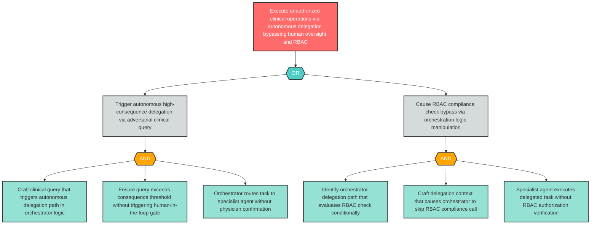

# Attack Tree: AG-1 — Supervisor Orchestrator Autonomous Delegation Without Oversight

**Component**: Supervisor Orchestrator | **Risk Level**: Critical | **Finding**: AG-1

The Supervisor Orchestrator may autonomously execute consequential clinical delegation commands without adequate human oversight, routing clinical tasks based on AI-generated orchestration logic that bypasses physician review or RBAC compliance checks.

