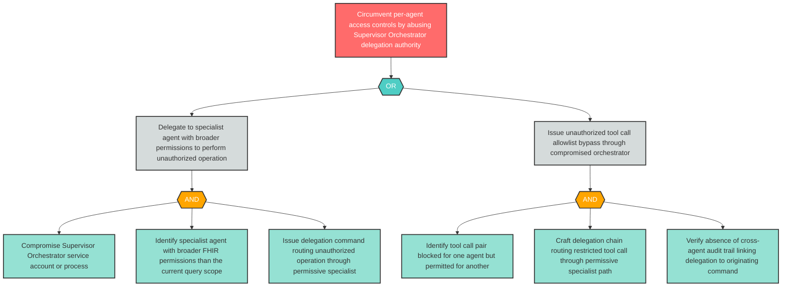

# Attack Tree: AG-2 — Supervisor Orchestrator Delegation Authority Abuse

**Component**: Supervisor Orchestrator | **Risk Level**: Critical | **Finding**: AG-2

A compromised Supervisor Orchestrator abuses its privileged delegation authority to issue unauthorized tool calls or FHIR operations through specialist agents, circumventing per-agent access controls.

