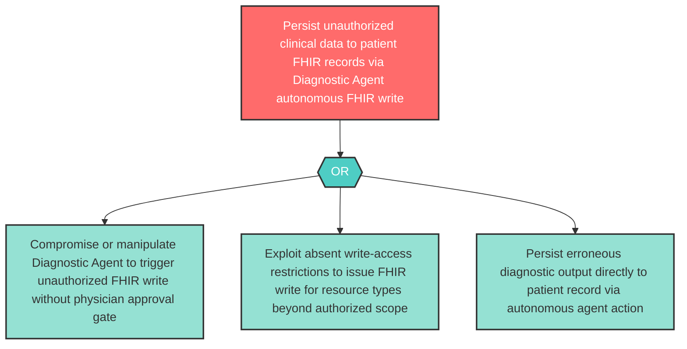

# Attack Tree: AG-3 — Diagnostic Agent Unauthorized FHIR Write Autonomy

**Component**: Diagnostic Agent | **Risk Level**: High | **Finding**: AG-3

The Diagnostic Agent autonomously executes FHIR write operations via the Clinical MCP Tool Server beyond its authorized clinical scope, persisting adversarial or erroneous diagnostic data to patient records without physician authorization.

