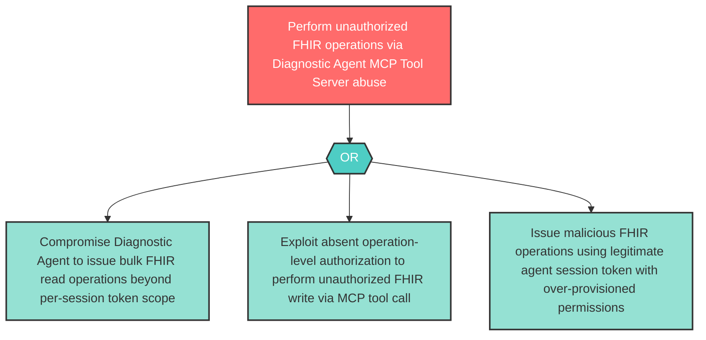

# Attack Tree: AG-4 — Diagnostic Agent MCP Tool Server Abuse

**Component**: Diagnostic Agent | **Risk Level**: High | **Finding**: AG-4

A compromised Diagnostic Agent abuses the Clinical MCP Tool Server as a tool abuse vector, issuing malicious FHIR operations (bulk reads, unauthorized writes) exceeding the agent's authorized scope.

