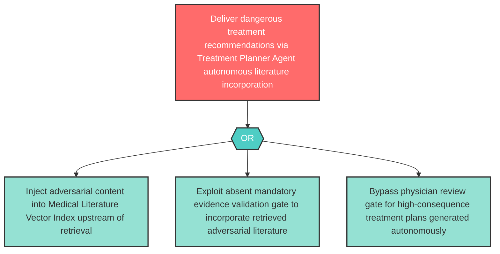

# Attack Tree: AG-5 — Treatment Planner Agent Autonomous Literature Incorporation Without Validation

**Component**: Treatment Planner Agent | **Risk Level**: High | **Finding**: AG-5

The Treatment Planner Agent autonomously incorporates adversarially retrieved medical literature into treatment plans without human validation, resulting in dangerous or contraindicated treatment recommendations delivered to physicians.

