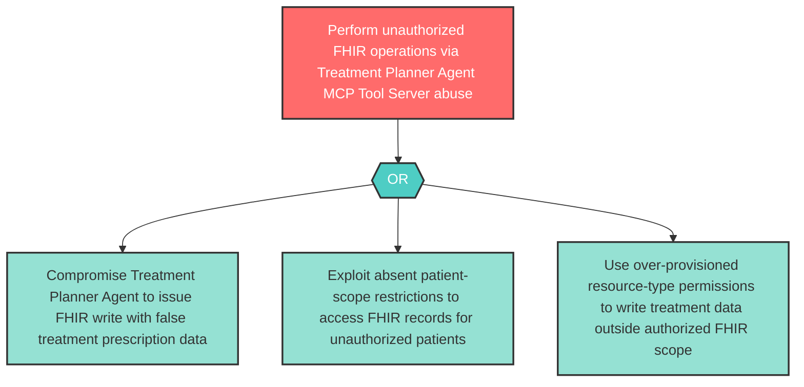

# Attack Tree: AG-6 — Treatment Planner Agent MCP Tool Server FHIR Abuse

**Component**: Treatment Planner Agent | **Risk Level**: High | **Finding**: AG-6

A compromised Treatment Planner Agent abuses the Clinical MCP Tool Server to perform unauthorized FHIR operations, writing false treatment prescriptions or accessing patient records outside the current patient scope.

