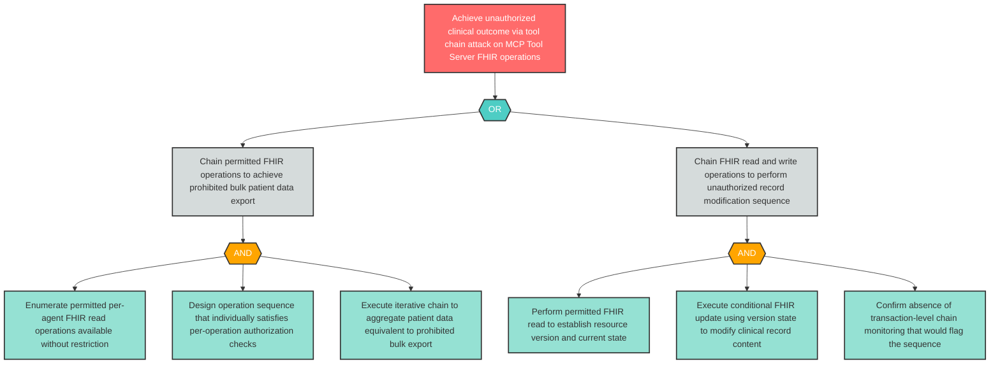

# Attack Tree: AG-7 — MCP Tool Server Tool Chaining Unauthorized Outcome Achievement

**Component**: Clinical MCP Tool Server | **Risk Level**: Critical | **Finding**: AG-7

A malicious or compromised agent exploits the Clinical MCP Tool Server to perform privilege escalation via tool chaining — executing sequences of individually-permitted FHIR operations that collectively achieve an unauthorized outcome.

