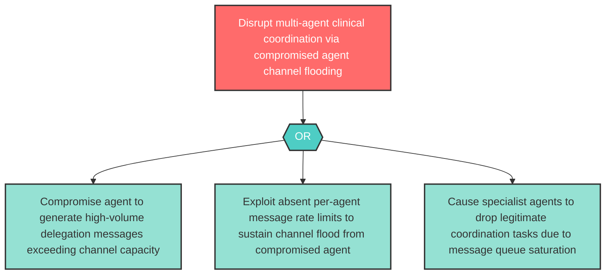

# Attack Tree: AG-8 — Inter-Agent Channel Resource Exhaustion via Compromised Agent Flood

**Component**: Inter-Agent Communication Channel | **Risk Level**: High | **Finding**: AG-8

A compromised or rogue agent abuses the Inter-Agent Communication Channel to flood specialist agents with excessive delegation messages, executing a resource exhaustion attack that disrupts multi-agent coordination.

